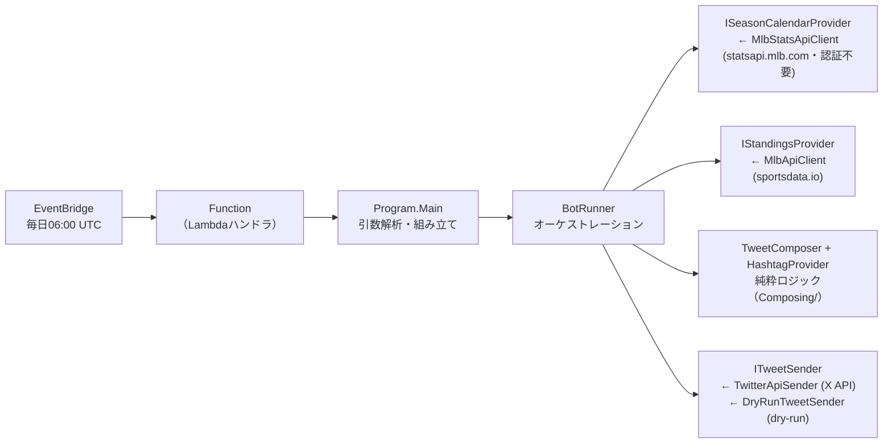

# CLAUDE.md

MLBの順位表を毎日X（Twitter）に投稿するボット。AWS Lambda上で毎日06:00 UTC（15:00 JST、EventBridgeルール `CronTweetMlbStandings`）に実行され、地区ごとに計6ツイートする（8月以降はリーグごとのワイルドカード順位2件を加えて計8ツイート）。レギュラーシーズン終了日を過ぎると自動で投稿を止める（スケジュール自体は年中起動する）。

## アーキテクチャ

「取得 → 文面組み立て → 送信」を分離し、取得元・送信先はinterfaceで差し替える構成（詳細図はREADME参照）。



- `TwitterMlbBot/` … 本体ロジック（OutputType=Exe。ローカル実行は `dotnet run --project TwitterMlbBot -- --dry-run`）
  - ドメインルールはデータ側に持たせる方針: `TeamStanding`（不変record・All-Star判定）、`DivisionStanding`（順位順を `RankedTeam` として型で保証）、`TweetContent`（280字上限の知識を持つ値オブジェクト）、`SeasonCalendar`（シーズン終了判定）、`RunOptions`（引数解析の純粋関数）
- `TwitterMlbBotExecution/src/` … Lambdaハンドラ（`Program.Main(null)` を呼ぶだけの薄いラッパー）
- `TwitterMlbBotExecution/test/` … Skip指定の手動疎通用テスト（`FunctionTest`）と、純粋ロジック・オーケストレーションの単体テスト（フェイク使用・ネットワーク不要）
- `infra/` … Terraformによるインフラ管理（使い方・残タスクは [infra/README.md](infra/README.md)）

## ビルド・テスト

```bash
dotnet build MlbBot.sln     # 全プロジェクトビルド
dotnet test MlbBot.sln      # 安全（実ツイートするFunctionTestはSkip指定済み）
dotnet format MlbBot.sln    # コード変更後に実行（CIが --verify-no-changes で検証する）
```

- ターゲットは net10.0（3プロジェクトすべて）。SDKは `global.json` で10.0系に固定
- コード内コメント・コミットメッセージのスタイルは日本語
- `.editorconfig` は最小構成。C#スタイルはRoslyn / dotnet format の既定値に任せる方針
- **テストは仕様ベースで書く**: 文面フォーマットの詳細・内部実装・具体的な例外型など変わりやすいものに依存させず、入出力の不変条件（データが文面に反映される、ツイートされない等）を検証する。リファクタや文面変更のたびにテストを直さなくて済む状態を保つ
- `.tf` ファイルをEdit/Writeすると、PostToolUseフック（`.claude/hooks/terraform-check.sh`）が `terraform fmt` を自動適用し `validate` を検証する

## ドライラン（ツイートせずに文面確認）

`--dry-run` 引数、または環境変数 `DRY_RUN=true` で、ツイートせず文面をコンソール出力する。
ドライラン時は送信先が `DryRunTweetSender`（コンソール出力のみ）に差し替わり、X API認証情報の読み込みも送信コードへの到達も起きないため、誤投稿は構造的に不可能（必要なのは `MLB_API_KEY` のみ）。`dotnet run --project TwitterMlbBot -- --dry-run`、またはVSCodeのlaunch構成「TwitterMlbBot (dry-run / ツイートしない)」で実行できる。

## ⚠️ 重要な注意事項

1. **`FunctionTest` のSkipを外したまま一括実行しないこと**: 本番の `Program.Main` を直接実行するため、認証情報がある環境では実ツイートが投稿される。手動の疎通確認専用。
2. **masterへのマージは本番デプロイ**: `.github/workflows/lambda_deploy.yml` の verify（ビルド+テスト）通過後、Releaseの `dotnet publish` 成果物がLambdaへデプロイされる（`.md`・`.github/`・`.vscode/`・`.gitignore` のみの変更は除く）。masterはbranch protectionで保護されており直pushは拒否される（PR + CIチェック `build-and-test` の通過が必須。管理者にも適用）。
3. **機密情報・環境固有情報を絶対にgit管理ファイルに入れない**: APIキーは環境変数（`MLB_API_KEY`, `CONSUMER_KEY`, `CONSUMER_SECRET`, `ACCESS_KEY`, `ACCESS_SECRET`）でのみ扱う。リージョン・バケット名・アカウントID等の環境固有値もコミットせず、gitignore対象ファイル（`backend.hcl`・`terraform.tfvars` 等）に置く。リポジトリに置くのは、書き換えないと必ずエラーになるダミー値を持つ `.example` のみ。コミット前にはこれらが含まれていないことを確認すること。機械的な防止として **git-secrets** のpre-commitフックを導入している（新しいclone環境では `git secrets --install && git secrets --register-aws` の実行と禁止パターンの再登録が必要。パターン自体が環境固有情報のためローカルのgit configにのみ保存し、コミットしない）。
4. **GitHub Actionsはcommit SHA固定**: `@v7` のようなタグではなく、フルcommit hash + バージョンコメント（例: `actions/checkout@3d3c42e... # v7.0.1`）で指定する。バージョン更新はDependabot（月次）が担う。
5. **`terraform apply` / `terraform destroy` は必ず人間が実行する**: Claudeが行うのは `plan`・`validate`・`fmt` まで（`.claude/settings.json` のdenyルールでも強制）。適用はレビュー後に人間が `infra/environments/prod` で実行する。
6. **tfファイルの変更は勝手にコミットしない**: `.tf` を含む `infra/` 配下の変更は、ユーザーがファイル内容を確認し、明示的にコミットの指示を出した時のみコミットする。

## 設定の仕組み

設定は**環境変数のみ**（ローカル・Lambda共通）。必須の環境変数が未設定の場合は `Program` が起動時に変数名入りのエラーで即失敗する。ドライラン時はX API系の変数を読み込まないため `MLB_API_KEY` だけで動く。

## ドメイン知識

- **X APIは従量課金**（投稿 $0.015/件・リンク入りは $0.20/件）。6〜8ツイート/日・シーズン中（3月末〜9月末）のみ投稿で年間約$19。ツイート件数を増やす変更はコスト増を意識すること
- **レギュラーシーズンの日程はMLB公式Stats API**（statsapi.mlb.com・認証不要・無料）から取得し、終了日の翌日以降は順位取得もツイートもせず終了する。日程の取得に失敗した場合は、シーズン中でありうる3〜10月はエラーログを出して投稿を続行（ログ監視アラームがメール通知）、明らかにシーズン外の11〜2月は例外で異常終了する（エラーアラームがメール通知）。どちらでもメールは届く。シーズン開始前はsportsdata.ioが空の順位を返すため自然に何も投稿されない（2027年の応答が空配列であることを実測確認済み）
- sportsdata.io のレスポンスには All-Star 用の擬似チーム（League と Division が同名: "AL"/"AL"）が含まれるため、`TeamStanding.IsAllStarPseudoTeam` で判定し `DivisionStanding.FromStandings` で除外している
- チーム公式ハッシュタグは `HashtagProvider` で一元管理（毎シーズン変わる可能性あり）
- X APIの連続POSTは503になるため、`TwitterApiSender` が送信後に1秒のインターバルを置いている
- OAuth1.0a署名は自前実装（`Authorization/OAuth1.cs`）。タイムスタンプが未来だとX APIに弾かれるため UNIXタイムスタンプ切り捨てを使用

## 改善計画ドキュメント

リファクタリングや機能追加の際は、まず以下を参照すること:

- [docs/tweet-content-ideas.md](docs/tweet-content-ideas.md) … ツイート文面の改善案
- [infra/README.md](infra/README.md) … インフラ構成（Terraform）の使い方と残タスク
