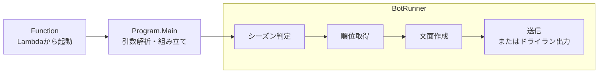

# 開発ガイド（Claude Code / Codex / Gemini共通）

MLBの順位表をX（Twitter）に投稿するボット。AWS Lambdaで実行する。
`AGENTS.md` はこのファイルへのシンボリックリンクなので、共通の指示はここを編集する。

## 作業時に守ること

- **ローカルの動作確認はドライランで行う。** 通常モードでは実際に投稿される。
- **`FunctionTest` のSkipを外したままテストを一括実行しない。** 本番の `Program.Main` を呼ぶため、手動の疎通確認専用とする。
- **masterへ直接pushしない。** PRとCIの `build-and-test` 通過が必須。管理者にもbranch protectionが適用される。
- **masterへのマージは本番デプロイにつながる。** 対象ファイルと検証内容は後述の「CI・デプロイ」を確認する。
- **APIキーや環境固有値をgit管理ファイルに書かない。** 保存先とclone後の設定は「認証情報・環境固有値」を参照する。
- **`terraform apply` / `terraform destroy` は人間が実行する。** エージェントは `plan`・`validate`・`fmt` までとし、適用はレビュー後に人間が `infra/environments/prod` で行う。
- **`infra/` 配下の変更は勝手にコミットしない。** `.tf` を含むファイル内容をユーザーが確認し、明示的にコミットを指示した場合に限る。
- **GitHub Actionsの `uses:` はフルcommit SHAとバージョンコメントで固定する。** タグだけの指定は使わず、`pin-github-actions` skillに従う。

リファクタリングや機能追加の前に、[ツイート文面の改善案](docs/tweet-content-ideas.md)と[インフラの使い方・残タスク](infra/README.md)を読む。

## ビルド・動作確認

```bash
dotnet build MlbBot.sln
# FunctionTestのSkipを維持すれば、実投稿なしで実行できる
dotnet test MlbBot.sln
dotnet format MlbBot.sln
```

- 3プロジェクトとも対象はnet10.0。SDKは `global.json` で10.0系に固定している。
- `Directory.Build.props` の `TreatWarningsAsErrors` により、警告もビルドエラーになる。依存パッケージ更新時も含め、その場で直す。
- コード変更後は `dotnet format` を適用する。CIは `--verify-no-changes` で検証する。
- コミット・push・PR作成前と変更の仕上げには、`pre-pr-check` skillで検証・機密情報スキャン・関連文書の確認を行う。
- 認証情報・権限・外部入力の扱いを変更するときは `security-hardening` skillで確認する。エージェントのフックは補助であり、アプリやIAM自体の防御の代わりにしない。

### ドライラン

```bash
dotnet run --project TwitterMlbBot -- --dry-run
```

`--dry-run` 引数、または環境変数 `DRY_RUN=true` で有効になる。
VSCodeのlaunch構成「TwitterMlbBot (dry-run / ツイートしない)」からも実行できる。

送信先は `DryRunTweetSender` になり、文面をコンソールに出力する。
X API認証情報を読み込まず、Xへの送信処理も呼ばない。必要な認証情報は `MLB_API_KEY` だけ。

## コードの変更方針

### 読みやすさ

- 今の規模に見合う単純な構成を保つ。層・interface・プロジェクトを増やすのは、読みやすさや変更範囲の限定に役立つ場合だけにする。
- 取得元・送信先はinterfaceで差し替える。外部通信のない文面生成は `TweetComposer` を直接使う。
- 複雑な条件式は、判断の意味がわかる変数に入れてから分岐する。例: `canRankTeam`、`shouldIncludeWildCards`。
- 単純なnullチェックや、名前だけで意味が伝わるboolに、説明用の変数を重ねない。
- コメントには「なぜその判断をするか」「避けたい問題に対してどう対応するか」を書く。処理の言い換えだけにしない。
- エラーメッセージは、取得できなかった情報や業務への影響が伝わる日本語にする。`null`や配列などの実装用語で説明せず、調査・復旧に必要な応答コードや環境変数名は補足として残す。
- コメント・コミットメッセージは日本語で書く。
- `this.` はフィールドと同名の引数を区別するときだけ付ける。
- その他のC#の書式はRoslyn / `dotnet format` の既定値に任せる。`.editorconfig` は最小構成を保つ。

### データの扱い

- 成績や順位など、オブジェクトが保持・公開するデータは作成後に変えられない形にする。
- 受け取った辞書は内容を固定して保持し、返すリストは読み取り専用にする。入力を後から変更しても、確定した結果に影響させない。
- 遅延評価で結果の確定が遅れる場合も、入力の変更による影響に注意する。
- メソッド内だけで使う一時リストや、不変recordの共有には不要なコピーを加えない。
- 外部APIのレスポンスはクライアント内のprivate recordで受け、検証してからドメインの型に変換する。欠落した勝敗を0で補わない。
- 成績の妥当性は `TeamStanding` の作成時に保証する。取得元を追加しても検証漏れが起きないよう、API解析側に同じ規則を重複させない。

### テストとREADME

- テストの追加・修正は `spec-based-testing` skillに従う。
- テストでは入力と結果の関係を確認する。文面の細かなレイアウト・内部実装・不要な例外型の指定に依存させない。
- 時刻やAPI応答は固定入力にし、外部通信はフェイクで置き換える。リファクタや文面変更だけでテストの修正が必要になる状態を避ける。
- READMEやこのガイドでは、構成・処理の流れをLR方向のMermaid図で示す。ルールや例外時の動作は文章・表で補い、まとめられる図はまとめる。
- READMEの見せ方を整理するときは、既存の情報を落とさない。変更されやすい時刻・件数・判定条件・バージョンは、情報の所在がわかる実装・設定へのリンクで案内する。
- 細かな設計意図はコードコメントやこのガイドに書く。日本語は自然で短い表現にし、引用でない文章を引用形式にしない。

## プログラムの構成

矢印は処理の順序を示す。取得元・送信先のクラス構成は[README](README.md)を参照する。



| 場所 | 内容 |
| --- | --- |
| `TwitterMlbBot/` | ボット本体。OutputTypeはExeで、ローカル実行もできる |
| `TwitterMlbBotExecution/src/` | Lambdaハンドラ。`Program.Main(null)` を呼ぶ |
| `TwitterMlbBotExecution/test/` | 通信不要のテストと、Skip付きの手動疎通用 `FunctionTest` |
| `infra/` | Terraformによるインフラ管理 |
| `.github/actions/verify-dotnet/` | CIとデプロイ前に使う共通の検証ステップ |
| `.claude/` | 共通のフック・skillとClaude Code用の登録設定 |

### 判断を置く場所

| クラス | 担当する判断・処理 |
| --- | --- |
| `Program` / `RunOptions` | 依存関係の組み立て / 引数解析。HTTP接続の寿命・タイムアウトは `Program` が管理し、各クライアントに渡す |
| `BotRunner` | 投稿するか、取得・送信に失敗したときに続けるかを判断する |
| `MlbApiClient` / `MlbStatsApiClient` | API固有のレスポンスを `TeamStanding` / `SeasonCalendar` に変換する。`ParseStandings` / `ParseSeasonCalendar` は通信なしで検証できる |
| `TeamStanding` | 作成時にチーム情報と勝敗を検証し、勝率・ゲーム差・順位付けの規則を持つ。プロパティを変更できないrecord |
| `DivisionStanding` / `WildCardStanding` | 地区・ワイルドカードの順位を決め、順位順の `RankedTeam` を返す |
| `SeasonCalendar` | シーズン終了後かどうかを判定する。不変record |
| `TweetComposer` / `HashtagProvider` | 投稿対象と文面を決める / 公式ハッシュタグを管理する |
| `TweetContent` | 投稿文面と重み付きの文字数上限を扱う値オブジェクト |
| `ITweetSender` の実装 | X APIへの送信、またはドライラン出力を行う |

## 投稿の仕様と背景

### 実行日と投稿対象

EventBridgeルール `CronTweetMlbStandings` が毎日06:00 UTC（15:00 JST）にLambdaを起動する。
通常は地区ごとに6件、8月以降はリーグごとのワイルドカード2件を加えて8件投稿する。
ワイルドカードを投稿する時期は `TweetComposer` が決める。

スケジュールは年中起動するが、レギュラーシーズン終了日の翌日以降は順位取得も投稿もしない。
終了日はMLB公式Stats API（statsapi.mlb.com、認証不要・無料）から取得する。
応答の先頭を採用せず、シーズンIDで対象年を特定する。対象がない・複数ある・終了日の年が一致しない場合は日程取得失敗として扱う。

| 日程・順位の状態 | 動作 |
| --- | --- |
| シーズン最終日まで | 順位を取得し、その日の文面を作る |
| シーズン終了日の翌日以降 | 順位取得・投稿を見送る |
| 日程取得に失敗し、3〜10月 | シーズン中の可能性があるため投稿を続ける。エラーログを出し、ログ監視アラームでメール通知する |
| 日程取得に失敗し、11〜2月 | シーズン外として投稿を見送る。警告ログのみで正常終了し、メール通知しない |
| 順位が空 | 投稿せず正常終了する |

シーズン開始前はsportsdata.ioが空配列を返すため、投稿も発生しない。
2027年の応答が空配列だったことは、過去の動作確認で確認済み。

### 順位と文面

- sportsdata.ioの応答にはAll-Star用の擬似チームが混ざる。リーグ名と地区名が同じ（`AL` / `AL`など）なので、`MlbApiClient.ParseStandings` で除外する。
- 順位が空なら投稿しない。データがある場合は、球団の重複とMLBの地区構成を `MlbApiClient` で検証する。球団・リーグの欠落や所属の異常を検出した場合は順位取得全体を失敗とし、不完全な順位表を投稿しない。球団拡張・地区再編時は `ValidateTeamCoverage` の構成定義も見直す。
- 勝率はAPIの小数3桁に丸めた値を使わず、勝敗から計算する。
- ゲーム差も勝敗から計算する。地区は首位、ワイルドカードはプレーオフ圏の最終枠を基準にする。定義は `TeamStanding.GamesBehind` にある。
- 公式ハッシュタグは `HashtagProvider` にまとめる。毎シーズン変わる可能性がある。
- Xの上限280字は重み付きで数える。ラテン文字などは1、CJK文字・絵文字は2とし、`TweetContent.CharacterCount` がtwitter-textの設定に沿って計算する。
- 結合絵文字は実際より多く数える場合があるため、上限超過の判定では警告だけを出す。送信は試み、実際に超過していればX APIが拒否する。

### 送信と失敗時の扱い

- 連続POSTで503になる問題への対策として、`TwitterApiSender` は次の投稿まで1秒空ける。最後の投稿の後は待たない。
- 応答がなくても投稿済みの可能性があるため、自動再送はしない。
- 送信先が例外を投げても、その1件の失敗として残りを続ける。全件失敗時だけ `AllTweetsFailedException` でエラー終了し、CloudWatchアラームからメール通知する。
- OAuth 1.0a署名は `Authorization/OAuth1.cs` で生成する。未来のタイムスタンプで拒否されないよう、UNIXタイムスタンプを切り捨てる。
- X APIは従量課金なので、投稿件数を増やす変更では費用も確認する。既存の運用メモでは通常投稿が$0.015/件、リンク入りが$0.20/件。シーズン中（3月末〜9月末）に6〜8件/日を投稿する場合の目安は年間約$19。

## 認証情報・環境固有値

設定はローカル・Lambdaともに環境変数だけを使う。
必須の変数が未設定なら、`Program` はその変数名を含むエラーで起動時に停止する。

| 実行方法 | 必要な環境変数 |
| --- | --- |
| ドライラン | `MLB_API_KEY` |
| 通常の投稿 | 上記に加え、`CONSUMER_KEY`・`CONSUMER_SECRET`・`ACCESS_KEY`・`ACCESS_SECRET` |

- リージョン・バケット名・アカウントIDなどは、gitignore対象の `backend.hcl`・`terraform.tfvars` などに置く。
- リポジトリに置く設定例は `.example` のみ。実値に書き換えなければ必ずエラーになるダミー値を使う。
- コミット前にAPIキーや環境固有値の混入を確認する。機械的な検出にはgitleaksとgit-secretsを使う。

新しくcloneした環境では、git-secretsのpre-commitフックを設定する。

```bash
git secrets --install
git secrets --register-aws
```

リポジトリ独自の禁止パターンも再登録する。
パターン自体に環境固有情報を含むため、ローカルのgit configだけに保存し、コミットしない。

## CI・デプロイ

PR検証の `ci.yml` とデプロイ前検証の `lambda_deploy.yml` は、共通のcomposite action `.github/actions/verify-dotnet/` を使う。
ビルド・フォーマット検証・テストの内容をそろえ、SDKバージョンは `global.json` から読む。

masterへの変更は、`lambda_deploy.yml` のverifyで検証・Releaseビルド・パッケージを行い、その実行の成果物だけをdeployジョブでLambdaへ配置する。
ビルド側には本番認証情報・OIDC発行権限を与えない。deploy側ではリポジトリをcheckoutせず、master以外の手動実行も拒否する。シェルの引数は環境変数で受けて引用し、式を直接埋め込まない。
Markdown・`.github/`・`.claude/`・`.agents/`・`.codex/`・`.vscode/`・`.gitignore`・`infra/` だけの変更は自動デプロイの対象外。
正確な対象は[ワークフローのpaths-ignore](.github/workflows/lambda_deploy.yml)を参照する。

GitHub Actionsの依存更新はDependabotが月次で1つのPRにまとめる。
レビューは `review-dependabot-prs` skillに従い、OK/NGを問わずPRに結果を残す。OKならマージし、NGなら保留する。

## Claude Code・Codex・Geminiの設定

共通ファイルの実体はClaude側に置き、他のエージェントから相対シンボリックリンクで参照する。
Gemini CLIでこの開発ガイドを読み込むには、`settings.json` の `context.fileName` に `AGENTS.md` を指定する（標準では `GEMINI.md` のみ）。skillは `.agents/skills` から読み込める。設定方法は[公式ガイド](https://geminicli.com/docs/cli/gemini-md/#customize-the-context-file-name)を参照。

| 参照するパス | 実体 |
| --- | --- |
| `AGENTS.md` | `CLAUDE.md` |
| `.agents/skills` | `../.claude/skills` |
| `.codex/hooks` | `../.claude/hooks` |

フックの登録形式はツールごとに異なるため、Claude Codeの `.claude/settings.json` とCodexの `.codex/hooks.json` は別々に管理する。
フックのパスはClaude Codeでは `CLAUDE_PROJECT_DIR`、Codexでは `git rev-parse --show-toplevel` で解決する。ユーザー固有の絶対パスは書かない。
Claude Codeでは、Terraformの適用・破棄を `.claude/settings.json` のdenyルールでも禁止している。

| 共通フック（`.claude/hooks/`） | 処理 |
| --- | --- |
| `guard-real-run.sh` | Bash実行前（PreToolUse）に通常モードのローカル実行を拒否する。`--dry-run` / `DRY_RUN=true` 付きは許可する |
| `terraform-check.sh` | Edit/Write後（PostToolUse）に `.tf` の変更を確認し、`terraform fmt` と `validate` を行う |

共通skillは `.claude/skills/` に置く。他のリポジトリでもそのまま使える内容にし、このリポジトリ固有の指示は含めない。基本のfrontmatterとMarkdownを使い、特定エージェントのツール名・専用設定・フックがないと実行できない手順にしない。

| skill | 用途 |
| --- | --- |
| `pre-pr-check` | 検証コマンド・機密情報・関連文書の最終確認 |
| `security-hardening` | CI・IAM・外部通信の安全性の確認と改善 |
| `pin-github-actions` | pinactでGitHub Actionsをフルcommit SHAに固定する |
| `spec-based-testing` | 仕様に基づくテストの作成・見直し |
| `review-dependabot-prs` | Dependabot PRのレビューとマージ判断。週次のroutineでも使う |
