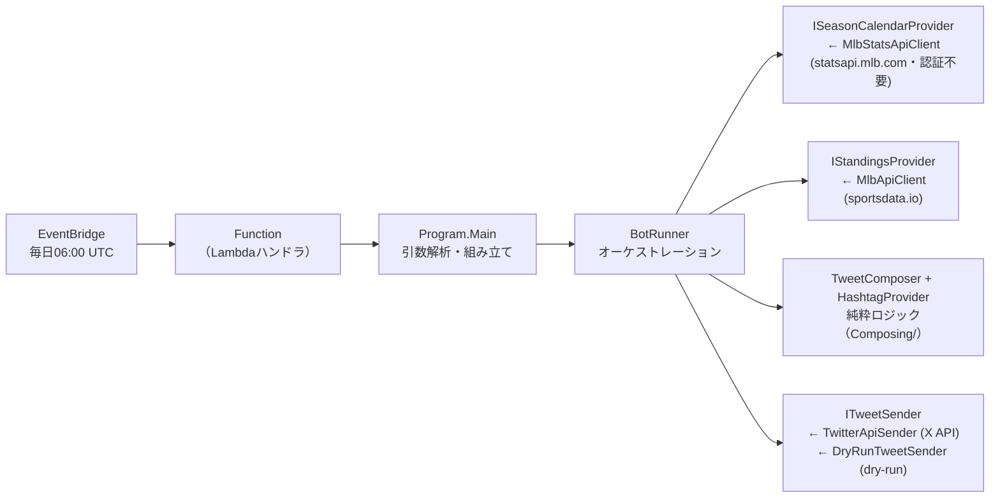

# CLAUDE.md

MLBの順位表を毎日X（Twitter）に投稿するボット。AWS Lambda上で毎日06:00 UTC（15:00 JST、EventBridgeルール `CronTweetMlbStandings`）に実行され、地区ごとに計6ツイートする（8月以降はリーグごとのワイルドカード順位2件を加えて計8ツイート）。レギュラーシーズン終了日を過ぎると自動で投稿を止める（スケジュール自体は年中起動する）。

## アーキテクチャ

「取得 → 文面組み立て → 送信」を分離し、取得元・送信先はinterfaceで差し替える構成（詳細図はREADME参照）。



- `TwitterMlbBot/` … 本体ロジック（OutputType=Exe。ローカル実行は `dotnet run --project TwitterMlbBot -- --dry-run`）
  - ドメインルールはデータ側に持たせる方針: `TeamStanding`（不変record。勝率の算出・ゲーム差・順位付け規則を持つ）、`DivisionStanding` / `WildCardStanding`（順位順を `RankedTeam` として型で保証）、`TweetContent`（280字上限の知識を持つ値オブジェクト）、`SeasonCalendar`（シーズン終了判定）、`RunOptions`（引数解析の純粋関数）
- 外部APIの形はクライアント内に閉じ込める: `MlbApiClient` / `MlbStatsApiClient` はレスポンス用のprivate recordで受け、ドメインの型（`TeamStanding` / `SeasonCalendar`）に変換してから渡す。解析部分は `ParseStandings` / `ParseSeasonCalendar` として切り出し、ネットワークなしでテストできる
- `TwitterMlbBotExecution/src/` … Lambdaハンドラ（`Program.Main(null)` を呼ぶだけの薄いラッパー）
- `TwitterMlbBotExecution/test/` … Skip指定の手動疎通用テスト（`FunctionTest`）と、純粋ロジック・オーケストレーションの単体テスト（フェイク使用・ネットワーク不要）
- `infra/` … Terraformによるインフラ管理（使い方・残タスクは [infra/README.md](infra/README.md)）
- `.github/actions/verify-dotnet/` … ビルド・フォーマット検証・テストの共通ステップ（composite action）。PR検証（`ci.yml`）とデプロイ前ゲート（`lambda_deploy.yml`）の両方がこれを使い、検証内容の差異が生まれないようにしている。SDKバージョンは `global.json` から読む
- `.claude/` … Claude Code用の設定（フック・skill）。詳細は後述の「Claude Code設定」

## ビルド・テスト

```bash
dotnet build MlbBot.sln     # 全プロジェクトビルド
dotnet test MlbBot.sln      # 安全（実ツイートするFunctionTestはSkip指定済み）
dotnet format MlbBot.sln    # コード変更後に実行（CIが --verify-no-changes で検証する）
```

- ターゲットは net10.0（3プロジェクトすべて）。SDKは `global.json` で10.0系に固定
- `Directory.Build.props` で `TreatWarningsAsErrors` を有効にしている。警告が出た変更（依存パッケージの更新を含む）はその場で直す
- コード内コメント・コミットメッセージのスタイルは日本語
- `.editorconfig` は最小構成。C#スタイルはRoslyn / dotnet format の既定値に任せる方針
- **テストは仕様ベースで書く**: 文面フォーマットの詳細・内部実装・具体的な例外型など変わりやすいものに依存させず、入出力の不変条件（データが文面に反映される、ツイートされない等）を検証する。リファクタや文面変更のたびにテストを直さなくて済む状態を保つ（判断基準はskill `spec-based-testing` にまとめてある）

## Claude Code設定（.claude/）

- フック（`.claude/settings.json` で登録）
  - `hooks/guard-real-run.sh`（PreToolUse・Bash）… ボットを通常モード（実ツイート）でローカル実行するコマンドを拒否する。`--dry-run` / `DRY_RUN=true` 付きは通す
  - `hooks/terraform-check.sh`（PostToolUse・Edit/Write）… `.tf` ファイルの変更時に `terraform fmt` を自動適用し `validate` を検証する
- skill（`.claude/skills/`。このリポジトリ固有の内容は含めず、他リポジトリにコピーしてそのまま使える汎用的なものにしている）
  - `pre-pr-check` … コミット・PR前の最終確認（検証コマンド実行、gitleaks / git-secrets による機密情報スキャン、ドキュメント追随）
  - `pin-github-actions` … GitHub Actionsの `uses:` をフルcommit SHA + バージョンコメントに固定する（pinactを使う）
  - `spec-based-testing` … 仕様ベースのテストを書く／見直すための判断基準

## ドライラン（ツイートせずに文面確認）

`--dry-run` 引数、または環境変数 `DRY_RUN=true` で、ツイートせず文面をコンソール出力する。
ドライラン時は送信先が `DryRunTweetSender`（コンソール出力のみ）に差し替わり、X API認証情報の読み込みも送信コードへの到達も起きないため、誤投稿は構造的に不可能（必要なのは `MLB_API_KEY` のみ）。`dotnet run --project TwitterMlbBot -- --dry-run`、またはVSCodeのlaunch構成「TwitterMlbBot (dry-run / ツイートしない)」で実行できる。

## ⚠️ 重要な注意事項

1. **`FunctionTest` のSkipを外したまま一括実行しないこと**: 本番の `Program.Main` を直接実行するため、認証情報がある環境では実ツイートが投稿される。手動の疎通確認専用。
2. **masterへのマージは本番デプロイ**: `.github/workflows/lambda_deploy.yml` の verify（ビルド+フォーマット検証+テスト）通過後、Releaseの `dotnet publish` 成果物がLambdaへデプロイされる（`.md`・`.github/`・`.claude/`・`.vscode/`・`.gitignore`・`infra/` のみの変更は除く）。masterはbranch protectionで保護されており直pushは拒否される（PR + CIチェック `build-and-test` の通過が必須。管理者にも適用）。
3. **機密情報・環境固有情報を絶対にgit管理ファイルに入れない**: APIキーは環境変数（`MLB_API_KEY`, `CONSUMER_KEY`, `CONSUMER_SECRET`, `ACCESS_KEY`, `ACCESS_SECRET`）でのみ扱う。リージョン・バケット名・アカウントID等の環境固有値もコミットせず、gitignore対象ファイル（`backend.hcl`・`terraform.tfvars` 等）に置く。リポジトリに置くのは、書き換えないと必ずエラーになるダミー値を持つ `.example` のみ。コミット前にはこれらが含まれていないことを確認すること。機械的な防止として **git-secrets** のpre-commitフックを導入している（新しいclone環境では `git secrets --install && git secrets --register-aws` の実行と禁止パターンの再登録が必要。パターン自体が環境固有情報のためローカルのgit configにのみ保存し、コミットしない）。
4. **GitHub Actionsはcommit SHA固定**: `@v7` のようなタグではなく、フルcommit hash + バージョンコメント（例: `actions/checkout@3d3c42e... # v7.0.1`）で指定する（skill `pin-github-actions` を使う）。バージョン更新はDependabot（月次・まとめて1PR）が担う。
5. **`terraform apply` / `terraform destroy` は必ず人間が実行する**: Claudeが行うのは `plan`・`validate`・`fmt` まで（`.claude/settings.json` のdenyルールでも強制）。適用はレビュー後に人間が `infra/environments/prod` で実行する。
6. **tfファイルの変更は勝手にコミットしない**: `.tf` を含む `infra/` 配下の変更は、ユーザーがファイル内容を確認し、明示的にコミットの指示を出した時のみコミットする。

## 設定の仕組み

設定は**環境変数のみ**（ローカル・Lambda共通）。必須の環境変数が未設定の場合は `Program` が起動時に変数名入りのエラーで即失敗する。ドライラン時はX API系の変数を読み込まないため `MLB_API_KEY` だけで動く。

## ドメイン知識

- **X APIは従量課金**（投稿 $0.015/件・リンク入りは $0.20/件）。6〜8ツイート/日・シーズン中（3月末〜9月末）のみ投稿で年間約$19。ツイート件数を増やす変更はコスト増を意識すること
- **レギュラーシーズンの日程はMLB公式Stats API**（statsapi.mlb.com・認証不要・無料）から取得し、終了日の翌日以降は順位取得もツイートもせず終了する。日程の取得に失敗した場合は、シーズン中でありうる3〜10月はエラーログを出して投稿を続行（ログ監視アラームがメール通知）、明らかにシーズン外の11〜2月はどのみち投稿対象がなく実害ゼロのため警告ログのみで正常終了する（メール通知なし）。シーズン開始前はsportsdata.ioが空の順位を返すため自然に何も投稿されない（2027年の応答が空配列であることを実測確認済み）
- sportsdata.io のレスポンスには All-Star 用の擬似チーム（League と Division が同名: "AL"/"AL"）が含まれるため、`MlbApiClient.ParseStandings` がAPI境界で除外し、ドメインには実在チームだけを渡す
- 勝率はAPIの値（小数3桁丸め）を使わず勝敗から算出し、ゲーム差も勝敗から計算する（地区順位は首位基準、ワイルドカードはプレーオフ圏ボーダー基準。定義は `TeamStanding.GamesBehind`）
- チーム公式ハッシュタグは `HashtagProvider` で一元管理（毎シーズン変わる可能性あり）
- X APIの連続POSTは503になるため、`TwitterApiSender` が投稿と投稿の間に1秒のインターバルを置いている（最後の1件の後は待たない）
- **Xの文字数上限280は重み付きカウント**（ラテン文字等は1、CJK文字・絵文字は2。twitter-textの設定に準拠）。`TweetContent.CharacterCount` がこのルールで数える。結合絵文字は安全側に多く数えるため、超過判定でも送信は止めず警告のみ（実際に超過していればX APIが拒否する）
- 送信先が例外を投げても（タイムアウト等）`BotRunner` はその1件の失敗として続行し、全件失敗の場合のみ `AllTweetsFailedException` でエラー終了する（CloudWatchアラーム → メール通知）
- OAuth1.0a署名は自前実装（`Authorization/OAuth1.cs`）。タイムスタンプが未来だとX APIに弾かれるため UNIXタイムスタンプ切り捨てを使用

## 改善計画ドキュメント

リファクタリングや機能追加の際は、まず以下を参照すること:

- [docs/tweet-content-ideas.md](docs/tweet-content-ideas.md) … ツイート文面の改善案
- [infra/README.md](infra/README.md) … インフラ構成（Terraform）の使い方と残タスク
