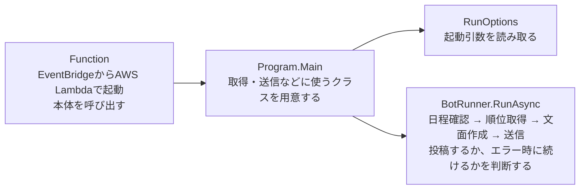
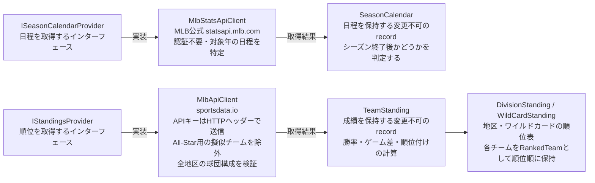
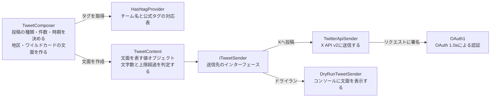
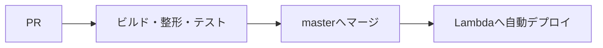

# MLB bot

MLBの順位表をXへ自動投稿するボットです。投稿先: [@MLBbot2](https://twitter.com/MLBbot2)

## プログラムの構成

本体は `TwitterMlbBot/` にあります。Lambdaからの呼び出しだけ、別プロジェクトの `TwitterMlbBotExecution/` で受け付けます。

### 起動から実行まで



EventBridgeのルール名・実行時刻・Lambdaで使う.NETのバージョンは、[Terraformの設定](infra/environments/prod/main.tf)で確認できます。

### 日程と順位の取得

取得元と送信先にはインターフェースを使い、テストでは実際のAPIに接続しない処理に差し替えます。



### 文面の作成と投稿

文面の作成では通信や環境変数を使いません。送信先を差し替えることで、同じ文面をXに投稿することも、ドライランで確認することもできます。



## 手元のPCで実行する

[global.jsonで指定している.NET SDK](global.json)をインストールし、環境変数 `MLB_API_KEY` にAPIキーを設定します。

```bash
dotnet build MlbBot.sln
dotnet test MlbBot.sln
MLB_API_KEY=xxx dotnet run --project TwitterMlbBot -- --dry-run
```

`xxx` は手元のAPIキーに置き換えてください。Xへの投稿はLambdaの定期実行に限り、手元のPCでは投稿せずに文面だけを確認するドライランを使います。

| 実行方法 | 出力先 | 必要な認証情報 |
|---|---|---|
| `--dry-run` / `DRY_RUN=true` | コンソール | MLBのみ |
| Lambdaの定期実行 | X | MLBとX |

VSCodeでは、実行構成 **TwitterMlbBot (dry-run / ツイートしない)** を選択してください。
コードを変更した後は `dotnet format MlbBot.sln` で整形します。

ドライランでは、次の見出しに続いて各順位表の文面が表示されます。

```text
----- dry-run: 以下はツイートされません（xx文字） -----
```

### 環境変数（ローカル・Lambda共通）

| 変数 | 用途 | 必要な場面 |
|---|---|---|
| `MLB_API_KEY` | sportsdata.io APIキー | すべて |
| `CONSUMER_KEY` | X Consumer Key | Xへ投稿するとき |
| `CONSUMER_SECRET` | X Consumer Secret | Xへ投稿するとき |
| `ACCESS_KEY` | X Access Token | Xへ投稿するとき |
| `ACCESS_SECRET` | X Access Token Secret | Xへ投稿するとき |
| `DRY_RUN` | `true` でドライラン | 任意 |

必要な環境変数が未設定の場合は、起動時に変数名を含むエラーを表示して終了します。ドライランではXの認証情報を読み込みません。

### 認証情報とclone後の設定

APIキーと実行時設定は環境変数で管理します。リージョン・バケット名・アカウントIDなどの環境固有値は、Git管理外の `backend.hcl`・`terraform.tfvars` に置きます。リポジトリには、実値に置き換えない限り失敗するダミー値の `.example` だけを置きます。詳しい配置は [infra/README](infra/README.md)を参照してください。

clone後はgit-secretsのpre-commitフックを設定します。

```bash
git secrets --install
git secrets --register-aws
```

リポジトリ独自の禁止パターンもローカルのGit設定に再登録します。環境固有情報を含むため、パターン自体をコミットしないでください。コミット前にはgitleaksとgit-secretsで混入を確認します。

## エージェントの設定

`make setup` で、導入済みのClaude Code・Codexに [agent-plugins](https://github.com/shin4488/agent-plugins)をユーザー単位でインストールします。共通skillの実体はプラグイン側で管理します。

導入後はツールを読み込み直し、リポジトリを信頼した上でCodexの `/hooks` で確認・承認します。登録コマンド変更時も再確認します。ホストにはBash・Git・jq・realpath・Terraformが必要です。Claudeの権限設定はCodexに引き継がれません。

編集後の共通hookはリポジトリの `.claude/hooks/post-edit.sh` を呼び、編集した `.tf` を整形し、初期化済みの `infra/environments/prod` で一度だけ検証します。実投稿を防ぐ `guard-real-run.sh` は両ツールの `PreToolUse` 登録に残します。`.codex/hooks` は `.claude/hooks` への相対リンクです。ドライランのコマンドは単独・引用なしで実行してください。

Gemini CLIでは `settings.json` の `context.fileName` に `AGENTS.md` を指定して共通の開発ガイドを読みます。プラグインの導入対象はClaude CodeとCodexです。

## デプロイ



| GitHub Secret | 用途 |
|---|---|
| `AWS_DEPLOY_ROLE_ARN` | OIDC認証で使用するIAMロールのARN |
| `AWS_REGION` | デプロイ先リージョン |
| `AWS_LAMBDA_FUNCTION_NAME` | デプロイ先Lambda名 |

GitHub ActionsはOIDCで一時的な認証情報を取得するため、長期アクセスキーは使いません。Lambdaにも、上記の表で「Xへ投稿するとき」に必要な変数と `MLB_API_KEY` を設定します。

変更してもデプロイが実行されないファイルやディレクトリは、[ワークフローの `paths-ignore`](.github/workflows/lambda_deploy.yml)で確認できます。

### 運用上の注意

- masterへマージすると本番に反映されます。ブランチ保護により直接pushできないため、PRを作成し、CIチェック `build-and-test` を通す必要があります。
- `FunctionTest` は、本番の `Program.Main` を直接呼んで接続を確認するためのテストです。Skipを解除すると実際に投稿されるため、他のテストとまとめて実行しないでください。
- APIキーは環境変数で管理し、ファイルに書いてコミットしないでください。

## 関連ドキュメント

| 文書 | 内容 |
|---|---|
| [開発上の判断と投稿仕様](docs/development.md) | 責務の分け方・投稿条件・失敗時の扱い |
| [ツイート改善案](docs/tweet-content-ideas.md) | 文面の改善や、掲載する情報の追加案 |
| [インフラ管理](infra/README.md) | Terraformの構成・運用手順・今後の対応 |
