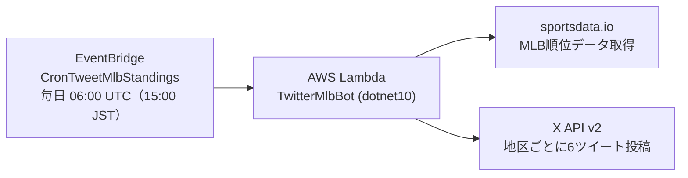
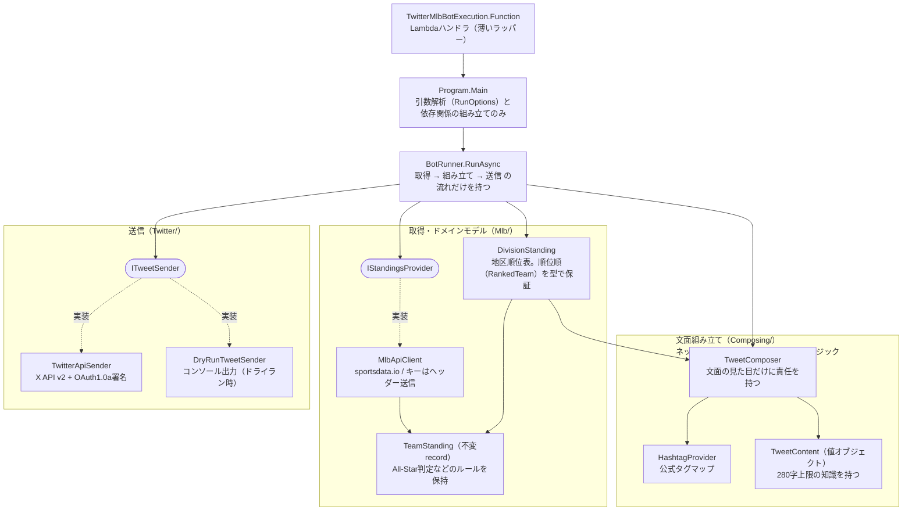

# MLB bot

MLBの順位表を毎日X（Twitter）に自動投稿するボット。投稿先: [@MLBbot2](https://twitter.com/MLBbot2)

## アーキテクチャ

### 実行環境



### 内部構造

「取得 → 文面組み立て → 送信」を分離し、取得元と送信先はinterfaceで差し替え可能にしている（テスト用フェイク・ドライランは送信先の差し替えで実現）。



## ローカルセットアップ

必要なもの: .NET 10 SDK（使用バージョンは [global.json](global.json) で10.0系に固定している）

```bash
dotnet build MlbBot.sln
```

設定値はローカル・Lambda共通で**環境変数**で渡す:

| 環境変数 | 内容 |
|---|---|
| `MLB_API_KEY` | sportsdata.io のAPIキー |
| `CONSUMER_KEY` | X API Consumer Key |
| `CONSUMER_SECRET` | X API Consumer Secret |
| `ACCESS_KEY` | X API Access Token |
| `ACCESS_SECRET` | X API Access Token Secret |
| `DRY_RUN`（任意） | `true` でドライラン |

必須の環境変数が未設定の場合は、変数名入りのエラーで起動時に失敗する（ドライランで必須なのは `MLB_API_KEY` のみ）。

## 実行方法

通常送信（実ツイート）はLambdaの定期実行経由のみとする。ローカルではドライランで文面を確認する。

### ドライラン（ツイートせず文面だけ確認する）

`--dry-run` 引数、または環境変数 `DRY_RUN=true` で、ツイートせずに文面をコンソール出力する。
ドライラン時はX APIの認証情報を読み込まないため、`MLB_API_KEY` だけで動く。

```bash
MLB_API_KEY=xxx dotnet run --project TwitterMlbBot -- --dry-run
```

- VSCode: launch構成「TwitterMlbBot (dry-run / ツイートしない)」を実行
- 出力例: `----- dry-run: 以下はツイートされません（xx文字） -----` に続けて各地区の文面

## ⚠️ 注意事項

1. **masterへのpush（マージ）は本番デプロイ**。[.github/workflows/lambda_deploy.yml](.github/workflows/lambda_deploy.yml) により、ビルド・テスト検証後にAWS Lambdaへ自動デプロイされる（`.md`・`.github/`・`.vscode/`・`.gitignore` のみの変更は除く）。
2. **`FunctionTest` は手動疎通確認専用**。本番の `Program.Main` をそのまま実行するためSkip指定してある。Skipを外して実行すると実際にツイートが投稿される。
3. **シークレットをコミットしない**。APIキーは環境変数でのみ扱い、リポジトリ内のファイルには書かない。

## デプロイに必要な設定

GitHub Secrets（Actionsデプロイ用）:

- `AWS_ACCESS_KEY_ID` / `AWS_SECRET_ACCESS_KEY` … デプロイ用IAMユーザーの認証情報
- `AWS_REGION` … `ap-northeast-1`
- `AWS_LAMBDA_FUNCTION_NAME` … デプロイ先Lambda関数名

Lambda環境変数（実行時）: `MLB_API_KEY`, `CONSUMER_KEY`, `CONSUMER_SECRET`, `ACCESS_KEY`, `ACCESS_SECRET`

## 改善計画ドキュメント

- [docs/code-improvements.md](docs/code-improvements.md) … 保守性・責務分離・DI導入の計画
- [docs/developer-experience.md](docs/developer-experience.md) … CI/CD・ツール整備の計画
- [docs/tweet-content-ideas.md](docs/tweet-content-ideas.md) … ツイート文面の改善案
- [docs/infrastructure.md](docs/infrastructure.md) … インフラのTerraform化方針
