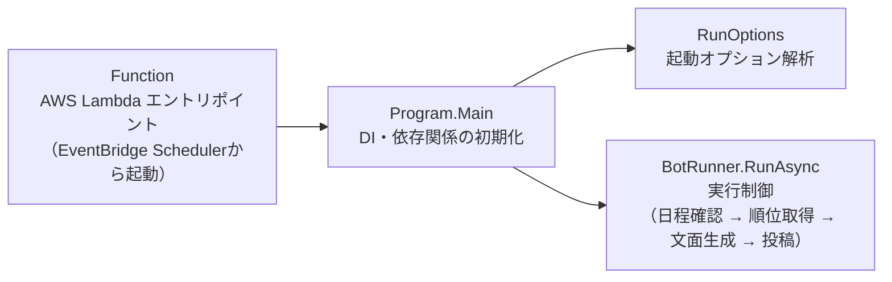
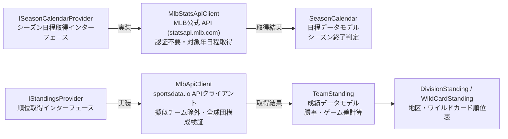
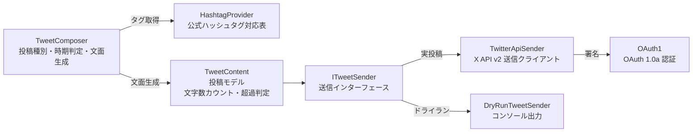
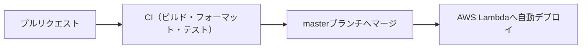

# MLB bot

MLBの順位表をX（旧Twitter）へ自動投稿するボットです。  
投稿先アカウント: [@MLBbot2](https://twitter.com/MLBbot2)

## プログラム構成

ボット本体の処理は `TwitterMlbBot/`、AWS Lambda からのエントリポイントは `TwitterMlbBotExecution/` に分離されています。

### 起動から実行までの流れ



- **実行スケジュール**: 東部（East）・中部（Central）・西部（West）の各代表現地時間 08:00 に起動し、該当地区の順位表を投稿します。
- **詳細仕様**: ワイルドカードの投稿時期や対象日の算出ルールなどは [投稿仕様](docs/development.md#投稿対象と対象日の算出)、インフラ設定は [Terraform設定](infra/environments/prod/main.tf) を参照してください。

### 日程と順位の取得

データ取得処理はインターフェースを介して抽象化されており、テスト時にはモックへの差し替えが可能です。



### 文面生成と投稿

文面生成ロジックは外部通信や環境変数に依存しません。送信インターフェース（`ITweetSender`）の実装を切り替えることで、Xへの実投稿とローカルでのドライラン（コンソール出力）を同一ロジックで実行します。



## ローカルでの実行

[global.json](global.json) で指定されている .NET SDK をインストールし、環境変数 `MLB_API_KEY` を設定して実行します。

```bash
dotnet build MlbBot.sln
dotnet test MlbBot.sln
MLB_API_KEY=xxx dotnet run --project TwitterMlbBot -- --dry-run
```

※ `xxx` には実際の API キーを指定してください。X への実投稿は Lambda の定期実行でのみ行い、ローカル環境ではコンソールに文面を出力するドライラン（`--dry-run`）を使用します。

| 実行方法 | 出力先 | 必要な認証情報 |
|---|---|---|
| `--dry-run` / `DRY_RUN=true` | コンソール | MLB API キー (`MLB_API_KEY`) |
| Lambda定期実行 | X | MLB API キー + X API 認証情報 |

VSCode を使用する場合は、実行構成 **TwitterMlbBot (dry-run / ツイートしない)** を選択できます。

### 実行オプション

- `--dry-run` 単独実行の場合、全3グループ（East, Central, West）を順に処理します。各グループの表示日を個別に算出し、日程と順位を取得します。
- 特定グループのみを確認する場合は `--group` を指定します。

```bash
dotnet run --project TwitterMlbBot -- --dry-run --group West
```

- `--group`: `East` / `Central` / `West` のいずれかを指定（通常投稿時は指定必須。未指定や不正値は実行前エラー）。
- 順位取得年の指定: 数値引数で年を明示指定可能（省略時は表示日の年を使用。年を指定しても表示日の算出基準は変わりません）。
- Lambda への入力: `{"group":"East"}` の形式でペイロードを渡します。

※ アプリケーションは `.env` を自動読み込みしないため、必要な環境変数はシェル等で設定してください。  
※ コード変更後は `dotnet format MlbBot.sln` でコードをフォーマットしてください。

ドライラン実行時は、以下のヘッダーに続いて生成文面が出力されます。

```text
----- dry-run: 以下はツイートされません（xx文字） -----
```

### 環境変数一覧

| 環境変数 | 説明 | 必須条件 |
|---|---|---|
| `MLB_API_KEY` | sportsdata.io API キー | 常時必須 |
| `CONSUMER_KEY` | X Consumer Key | X 投稿時 |
| `CONSUMER_SECRET` | X Consumer Secret | X 投稿時 |
| `ACCESS_KEY` | X Access Token | X 投稿時 |
| `ACCESS_SECRET` | X Access Token Secret | X 投稿時 |
| `DRY_RUN` | `true` でドライラン実行 | 任意 |

※ 必要な環境変数が未設定の場合、起動時に該当の変数名を出力して終了します。ドライラン実行時は X の認証情報は不要です。

### 認証情報の管理とリポジトリ設定

- API キーなどの実行時設定は環境変数で管理します。
- AWS リージョン、S3 バケット名、AWS アカウント ID などの環境固有値は、Git 管理対象外の `backend.hcl` や `terraform.tfvars` で管理します。リポジトリにはテンプレートとなる `.example` ファイルのみを配置しています（詳細は [infra/README.md](infra/README.md) 参照）。
- リポジトリの clone 後は、git-secrets の pre-commit フックをセットアップしてください。

```bash
git secrets --install
git secrets --register-aws
```

リポジトリ固有の禁止パターンもローカルの Git 設定に登録し、コミット前に gitleaks および git-secrets で機密情報の混入がないことを確認します。

## AIエージェント設定

`make setup` を実行すると、Claude Code / Codex 向けに [agent-plugins](https://github.com/shin4488/agent-plugins) がユーザー環境単位でインストールされます。共通 skill の実体はプラグイン側で管理されます。

- インストール後は各ツールを再読込し、リポジトリの信頼および Codex の `/hooks` で確認・承認を行います（登録コマンド変更時も同様）。
- 動作には Bash、Git、jq、realpath、Terraform が必要です（Claude の権限設定は Codex には引き継がれません）。
- 共通フック（`.claude/hooks/post-edit.sh`）は、ファイル編集後に `.tf` のフォーマットと `infra/environments/prod` での検証を実行します。
- X への誤投稿を防止するガード（`guard-real-run.sh`）は、各ツールの `PreToolUse` に設定されます（`.codex/hooks` は `.claude/hooks` への相対リンク）。ドライランコマンドは引用符なしの単一コマンドとして実行してください。
- Gemini CLI を利用する場合は、`settings.json` の `context.fileName` に `AGENTS.md` を指定して開発ガイドを読み込みます。

## デプロイ



### GitHub Secrets 設定

| シークレット名 | 用途 |
|---|---|
| `AWS_DEPLOY_ROLE_ARN` | GitHub Actions OIDC 認証で使用する IAM ロール ARN |
| `AWS_REGION` | デプロイ先 AWS リージョン |
| `AWS_LAMBDA_FUNCTION_NAME` | デプロイ先 Lambda 関数名 |

GitHub Actions は OIDC 連携により一時クレデンシャルを取得してデプロイを実行するため、長期の AWS アクセスキーは使用しません。Lambda 側にも X API 認証情報および `MLB_API_KEY` を環境変数として設定します。

※ 自動デプロイの対象外ファイル・ディレクトリは [ワークフロー設定（paths-ignore）](.github/workflows/lambda_deploy.yml) で定義されています。

### 運用上の注意点

- **本番反映**: `master` ブランチへのマージにより本番環境へ自動反映されます。ブランチ保護が設定されているため直接 push は行えず、PR 作成と CI チェック（`build-and-test`）の通過が必須です。
- **結合テスト**: `FunctionTest` は本番の `Program.Main` を直接呼び出すテストです。Skip を解除すると実際に X へ投稿されるため、通常のテストスイートと同時に実行しないでください。

## 関連ドキュメント

| ドキュメント | 概要 |
|---|---|
| [開発・投稿仕様](docs/development.md) | 責務設計、投稿条件、エラーハンドリング仕様 |
| [ツイート改善案](docs/tweet-content-ideas.md) | 文面改善および追加データ掲載のアイデア |
| [インフラ管理](infra/README.md) | Terraform 構成、運用手順、インフラ設計 |
