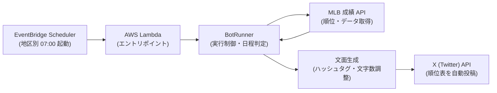

# MLB bot

メジャーリーグベースボール（MLB）の順位表をX（旧Twitter）へ自動投稿する .NET 製のボットです。  
- 投稿先アカウント: [@MLBbot2](https://twitter.com/MLBbot2)

---

## 概要とアーキテクチャ

AWS EventBridge Scheduler により、各地区（East / Central / West）の現地時間 朝 07:00 に AWS Lambda が起動され、該当地区の順位表やワイルドカード争いの状況を自動投稿します。



---

## プロジェクト構成

- **`TwitterMlbBot/`**: ボット本体のコアロジック（順位取得、文面フォーマット、X API送信）。
- **`TwitterMlbBotExecution/`**: AWS Lambda からの実行エントリポイント。
- **`infra/`**: AWS Lambda や EventBridge 等のインフラを管理する Terraform 定義。

---

## ローカルでの実行（ドライラン）

X への実投稿を行わず、生成される投稿文面をコンソールに出力するドライランモードが用意されています。

### 前提条件
- .NET 8 SDK（`global.json` に準拠）
- sportsdata.io の MLB API キー

### 実行コマンド

```bash
# 全地区（East, Central, West）の順位をドライラン出力
MLB_API_KEY=your_api_key dotnet run --project TwitterMlbBot -- --dry-run

# 特定地区のみを確認する場合（例: West）
MLB_API_KEY=your_api_key dotnet run --project TwitterMlbBot -- --dry-run --group West
```

ドライラン実行時は、以下のように生成された投稿テキストと文字数がコンソールに出力されます：

```text
----- dry-run: 以下はツイートされません（xx文字） -----
【MLB順位表 ア・リーグ西地区】
...
```

---

## 環境変数

| 変数名 | 説明 | 必須条件 |
|---|---|---|
| `MLB_API_KEY` | sportsdata.io API キー | 常時必須 |
| `CONSUMER_KEY` | X API Consumer Key | 実投稿時（Lambda） |
| `CONSUMER_SECRET` | X API Consumer Secret | 実投稿時（Lambda） |
| `ACCESS_KEY` | X API Access Token | 実投稿時（Lambda） |
| `ACCESS_SECRET` | X API Access Token Secret | 実投稿時（Lambda） |
| `DRY_RUN` | `true` でドライラン実行 | 任意（CLIオプションでも指定可） |

---

## テストとコード品質

```bash
# ソリューション全体のビルド
dotnet build MlbBot.sln

# 単体テストの実行
dotnet test MlbBot.sln

# コードフォーマットの検証・修正
dotnet format MlbBot.sln
```

---

## デプロイ

`master` ブランチへのプルリクエストマージをトリガーに、GitHub Actions がビルド・テストを実行し、OIDC 認証経由で AWS Lambda へ自動デプロイを行います。
