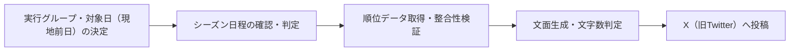

# 投稿仕様と開発ガイド

本ドキュメントでは、MLBボットの投稿スケジュール、順位表のデータ処理仕様、エラーハンドリング方針、および各コンポーネントの責務についてまとめます。

## 処理フロー

実行時の全体の流れは以下のとおりです。

ボットは年間を通して定期実行されますが、シーズン期間やデータの状態に応じて投稿要否を判定します。起動スケジュールは [インフラ設定](../infra/environments/prod/main.tf)、投稿種別や文面生成ルールは [TweetComposer](../TwitterMlbBot/Composing/TweetComposer.cs) で定義されています。

## 投稿対象と対象日の算出

### グループ別の投稿スケジュール

| グループ | 代表タイムゾーン | 起動時刻（現地時間） | 投稿対象 |
| --- | --- | --- | --- |
| East | America/New_York | 08:00 | AL East・NL East |
| Central | America/Chicago | 08:00 | AL Central・NL Central |
| West | America/Los_Angeles | 08:00 | AL West・NL West（表示日が8月以降はAL/NLワイルドカードも追加） |

### 算出ルールとデータ取得仕様

| 項目 | 仕様 | 詳細・具体例 |
| --- | --- | --- |
| **起動時刻** | 各代表タイムゾーンの現地時間 08:00 | サマータイム（夏時間）は EventBridge Scheduler とタイムゾーン変換で自動吸収 |
| **表示日（対象日）** | 各代表タイムゾーンの前日日付 | ・順位取得年も前日の年を使用 ・レギュラーシーズン最終日の翌朝実行時まで前日分（最終日分）の順位を投稿 ・**WC適用例**: Westグループの8月1日朝実行（前日7月31日分）はWCなし、8月2日朝実行（前日8月1日分）からWC追加 |
| **取得データの特性** | 起動時点でAPIから取得した最新順位 | ・前日の全試合終了や反映完了の待機・照合・再確認は行わない ・試合がない日や全試合延期の日でも、正常な順位データが取得できれば投稿 |
| **球団検証** | 全30球団の存在・構成を検証 | グループ別の地区に絞り込む前に全30球団の存在を検証（ワイルドカード順位も全地区のデータから算出） |

## 投稿・スキップの判定条件

| 日程・順位の状態 | 動作 | ログ記録・通知 |
| --- | --- | --- |
| レギュラーシーズン最終日まで | 順位を取得し、データが存在すれば投稿 | 通常ログ |
| シーズン終了日の翌日以降 | 順位取得・投稿をスキップ | 正常終了（ログ記録のみ） |
| 日程取得失敗（シーズン中の可能性あり） | 順位取得・投稿処理を継続 | エラーログ記録・メール通知 |
| 日程取得失敗（シーズン外と判断可能） | 順位取得・投稿をスキップ | 警告ログ記録・正常終了（通知なし） |
| 順位データが空 | 投稿をスキップ | 正常終了（シーズン開始前の空データも同様） |

- 日程情報は [MLB公式Stats API](https://statsapi.mlb.com/)（認証不要）から取得します。
- 対象年のシーズンIDで絞り込みを行い、対象データが存在しない・複数件ある・終了年の不整合がある場合は、日程取得失敗としてフォールバック判定を行います。
- 判定ロジックの詳細は [SeasonCalendar](../TwitterMlbBot/Mlb/SeasonCalendar.cs) および [BotRunner](../TwitterMlbBot/BotRunner.cs) を参照してください。

## 順位表の作成と文面生成仕様

| 項目 | 仕様・処理内容 | 関連実装 |
| --- | --- | --- |
| **不完全データの除外と球団検証** | ・sportsdata.io から取得したデータから、All-Star用の擬似チーム（リーグ名と地区名が同一）を除外 ・球団の重複、欠落、所属リーグ・地区の不整合がないかを検証（30球団構成の担保） | [MlbApiClient.cs](../TwitterMlbBot/Mlb/MlbApiClient.cs) （`ValidateTeamCoverage`） |
| **勝率・ゲーム差の算出** | ・API提供の丸め済み値は使用せず、勝敗数から算出 ・**ゲーム差の基準**: 　- 地区順位: 首位チーム基準 　- ワイルドカード: プレーオフ圏内最終枠（当確ライン）基準 | [TeamStanding.cs](../TwitterMlbBot/Mlb/TeamStanding.cs) （`GamesBehind`） |
| **公式ハッシュタグの付与** | ・チーム名と公式ハッシュタグの対応表を管理 ・シーズンごとのタグ変更に対応 | [HashtagProvider.cs](../TwitterMlbBot/Composing/HashtagProvider.cs) |
| **文字数カウント仕様** | ・X API の仕様に準拠したカウント方式を採用 ・結合絵文字等のカウント差異を考慮し、計算上の上限超過時でも警告ログを出力して送信を試行（実際の超過時はX API側でエラー） | [TweetContent.cs](../TwitterMlbBot/Composing/TweetContent.cs) （`CharacterCount`） |

## 送信制御とエラーハンドリング

**Xへの投稿リクエスト後、レスポンス受信に失敗した場合でも実際には投稿が完了している可能性があるため、二重投稿防止の観点から自動再送は行いません。**

| 状況 | 動作仕様 |
| --- | --- |
| 複数ツイートの連続投稿 | 連続リクエストによるレート制限・一時エラー（503）を回避するため、投稿間に待機時間を設ける（最終ツイート後は待機なし） |
| 一部のツイート送信失敗 | 当該ツイートのエラーを記録し、残りのツイート送信を継続 |
| 全ツイート送信失敗 | `AllTweetsFailedException` をスローして異常終了し、CloudWatchアラーム経由でSNS通知 |

- 送信間隔の制御は [TwitterApiSender](../TwitterMlbBot/Twitter/TwitterApiSender.cs)、全体の実行制御は [BotRunner](../TwitterMlbBot/BotRunner.cs) を参照してください。
- Lambdaの自動再試行もインフラ設定側で無効化（0回）しています。将来的に再実行機能を導入する場合は、アプリケーション側での重複排除の仕組みが必須となります。
- OAuth 1.0a 認証用のタイムスタンプは、時計の微小な進みによる認証エラーを防ぐため秒未満を切り捨てて生成します（[OAuth1](../TwitterMlbBot/Authorization/OAuth1.cs) 参照）。

## コンポーネント構成と責務

| ディレクトリ / クラス | 主な責務 |
| --- | --- |
| [Program.cs](../TwitterMlbBot/Program.cs) | アプリケーションのエントリポイント。DIコンテナの構成、外部クライアントの初期化とリソース破棄を管理 |
| [BotRunner.cs](../TwitterMlbBot/BotRunner.cs) | 実行フローの制御。日程判定、順位取得、文面生成、投稿実行、およびエラーハンドリングの統括 |
| [Mlb/](../TwitterMlbBot/Mlb/) | 外部API（Stats API、sportsdata.io）との通信、データパース、球団構成検証 |
| [TeamStanding.cs](../TwitterMlbBot/Mlb/TeamStanding.cs) | 球団成績データモデル。勝率およびゲーム差の計算処理 |
| [Composing/](../TwitterMlbBot/Composing/) | 投稿文面の組み立て、ハッシュタグ付与、文字数カウント |
| [Twitter/](../TwitterMlbBot/Twitter/) | X API への投稿クライアント（実投稿用およびドライラン用） |

データ取得および送信処理はインターフェースで抽象化されており、外部通信を伴わない単体テストが可能です。処理間の詳細な依存関係は [README.md](../README.md#プログラム構成) を参照してください。
