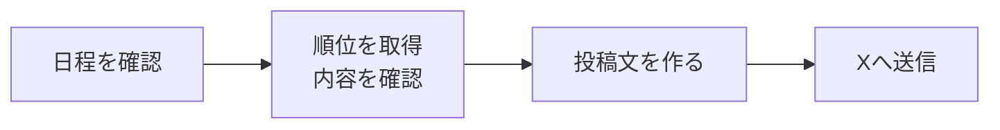

# 投稿の流れと開発時の注意点

投稿する日、順位表の作り方、送信に失敗したときの動きをまとめる。変更する内容に関係する節を読む。実行権限と必須の検証は [開発ガイド](../CLAUDE.md)、環境の管理は [インフラ資料](../infra/README.md)を参照する。

## 投稿までの流れ

投稿する場合は、次の順に処理する。

ボットは年間を通して起動するが、毎回投稿するわけではない。起動時刻は [実行設定](../infra/environments/prod/main.tf)、投稿の種類・件数・ワイルドカードを含める時期は [文面を作る処理](../TwitterMlbBot/Composing/TweetComposer.cs)で確認する。

## 投稿する・見送る条件

| 日程・順位の状態 | 動作 | 記録・通知 |
| --- | --- | --- |
| レギュラーシーズン最終日まで | 順位を取得し、データがあれば投稿する | — |
| シーズン終了日の翌日以降 | 順位取得・投稿を見送る | 正常終了 |
| 日程を取得できず、シーズン中の可能性がある | 順位を取得し、投稿を続ける | エラーを記録し、メール通知 |
| 日程を取得できず、シーズン外と判断できる | 順位取得・投稿を見送る | 警告を記録して正常終了。メール通知なし |
| 順位データが空 | 投稿しない | 正常終了。シーズン開始前の空データも同じ扱い |

日程は認証不要のMLB公式Stats APIから取得する。シーズンIDで対象年のデータを選び、先頭のデータを無条件に使わない。**対象がない・複数ある・終了日の年が違う場合は、日程を取得できなかったものとして扱う。**

日程が不明なときの期間の区切りは [SeasonCalendar](../TwitterMlbBot/Mlb/SeasonCalendar.cs)、続行・見送りの処理は [BotRunner](../TwitterMlbBot/BotRunner.cs)を確認する。

## 順位表と文面を作るとき

- **不完全な順位表は投稿しない。** sportsdata.ioの取得結果から、All-Star用の仮のチーム（リーグ名と地区名が同じもの）を除く。その上で、球団の重複・球団やリーグの不足・所属の誤りを確認する。球団追加や地区再編では [MlbApiClient](../TwitterMlbBot/Mlb/MlbApiClient.cs) の `ValidateTeamCoverage` も見直す。
- **勝率・ゲーム差は勝敗から計算する。** APIが返す丸め済みの勝率は使わない。ゲーム差は、地区では首位、ワイルドカードではプレーオフ出場圏内の最後の枠を基準にする。ゲーム差の計算は [TeamStanding](../TwitterMlbBot/Mlb/TeamStanding.cs) の `GamesBehind` にまとめる。
- **公式ハッシュタグはシーズンごとに変わり得る。** 文面を変えるときは、対象チームのタグを [HashtagProvider](../TwitterMlbBot/Composing/HashtagProvider.cs) で確認する。
- **文字数はXの数え方に合わせる。** 文字・絵文字の種類に応じた数え方は [TweetContent](../TwitterMlbBot/Composing/TweetContent.cs) の `CharacterCount` にある。組み合わせでできた絵文字を多めに数える場合があるため、計算上の上限超過では警告だけを出して送信を試みる。本当に上限を超えていればXが拒否する。

## 送信時の注意と失敗したときの動き

**応答が返らなくても、Xへの投稿は済んでいる可能性がある。二重投稿を防ぐため、自動再送しない。**

| 状況 | 動作・理由 |
| --- | --- |
| 複数の文面を続けて送る | 連続送信によるエラー（503）を避けるため、間隔を空ける。最後の投稿後は待たない |
| 一部の送信でエラーが起きる | その1件を失敗として記録し、残りの送信を続ける |
| すべての送信に失敗する | `AllTweetsFailedException` でエラー終了し、CloudWatchの監視からメール通知する |

送信間隔は [TwitterApiSender](../TwitterMlbBot/Twitter/TwitterApiSender.cs)、失敗時の処理は [BotRunner](../TwitterMlbBot/BotRunner.cs)を参照する。

- AWS Lambdaのエラー時の自動やり直しも、実行設定で無効にする。ただし、AWSから同じ処理が複数回呼ばれる可能性まではなくならない。再実行機能を追加するときは、**同じ内容を二重投稿しない仕組み**も設計する。
- 認証用の時刻は秒未満を切り捨てる。時刻が未来にずれて認証を拒否されるのを防ぐため。[OAuth1](../TwitterMlbBot/Authorization/OAuth1.cs) のUNIXタイムスタンプの処理を確認する。
- 投稿件数やリンクを増やすときは、X APIの利用料金も確認する。

## 変更する処理を探す

| 変更したいこと | 確認する場所・分け方 |
| --- | --- |
| 起動時の準備 | [Program](../TwitterMlbBot/Program.cs)。外部サービスへの接続設定と、使い終わった接続の後片付けを管理する |
| 取得・投稿を続けるかの判断 | [BotRunner](../TwitterMlbBot/BotRunner.cs) |
| 取得データの読み取り・検証 | [Mlb](../TwitterMlbBot/Mlb/) 内のAPI接続処理にまとめ、サービスごとのデータ形式の違いをほかへ持ち込まない |
| 勝敗の確認・順位の計算 | [TeamStanding](../TwitterMlbBot/Mlb/TeamStanding.cs) と、同じディレクトリの順位を扱う処理 |
| 投稿対象の選択・文面の作成 | [Composing](../TwitterMlbBot/Composing/) |

データ取得と送信はテスト用の処理に差し替えられるようにし、取得データの読み取り・検証も外部通信なしで試せる形に保つ。処理同士の詳しいつながりは [READMEの構成図](../README.md#プログラムの構成)を参照する。

時刻・件数・料金などの現在値は元の設定・実装を確認する。この資料には全ファイルの一覧や一時的な確認結果を追記しない。
