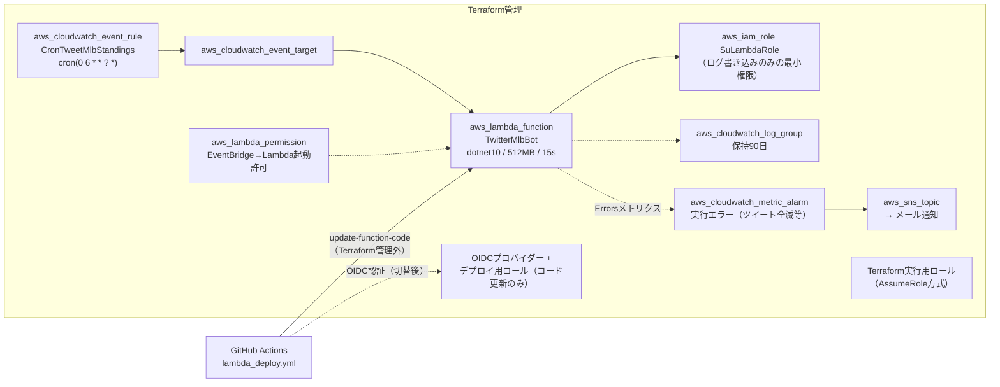

# infra — Terraformによるインフラ管理

MLBボットのAWSリソースをTerraformで管理する。**関数コードのデプロイはGitHub Actionsのまま**で、Terraformはインフラ設定のみを扱う。

## ディレクトリ構成

```
infra/
├── .terraform-version        … tfenv用のバージョン固定（global.jsonと同じ発想）
├── modules/
│   └── scheduled_lambda/     … 共通モジュール: 定期実行Lambda一式
│                                （Lambda関数 + 実行ロール + ロググループ + EventBridgeスケジュール）
└── environments/
    └── prod/                 … 本番環境の実リソース定義（ここでterraformコマンドを実行する）
        ├── main.tf                     … scheduled_lambdaモジュールに実際の値を渡す
        ├── backend.tf                  … state管理の説明とS3移行手順（暫定ローカルstate）
        ├── backend.hcl.example         … S3バックエンド設定の雛形（実物はgitignore）
        ├── terraform.tfvars.example    … 環境固有値の雛形（実物はgitignore）
        └── providers.tf / variables.tf / outputs.tf / versions.tf
```

## 管理しているリソース



- Lambdaの**コード関連属性と環境変数は `ignore_changes` で管理外**（コードはActionsがデプロイ、APIキーはLambda側で直接管理し `.tf` に書かない）

## 初回セットアップ（clone直後）

```bash
cd infra/environments/prod
cp terraform.tfvars.example terraform.tfvars   # 実際の値に書き換える
cp backend.hcl.example backend.hcl             # 実際の値に書き換える
terraform init -backend-config=backend.hcl
terraform plan    # 既存インフラと一致していれば「No changes」になる
```

## 日常の使い方

```bash
cd infra/environments/prod
terraform plan     # 差分確認
terraform apply    # インフラ設定を変更するとき
terraform fmt -recursive && terraform validate   # コミット前
```

## state（⚠️ 重要）

- stateは**S3バックエンド**で管理（非公開・暗号化・バージョニング設定済みのバケット）。接続情報は環境固有のためgitignore対象の `backend.hcl` で渡す（雛形: [backend.hcl.example](environments/prod/backend.hcl.example)）
- stateには**Lambda環境変数の値が平文で入る**。バケットやstateの内容を公開・共有しないこと

## 運用メモ

- アラームのメール通知は、apply後にAWSから届く確認メールの「Confirm subscription」を承認するまで有効にならない
- デプロイのOIDC切替は「apply → GitHub Secretsに `AWS_DEPLOY_ROLE_ARN`（デプロイ用ロールのARN）を登録 → ワークフローをOIDC認証へ変更するPR」の順で行う
- Terraform実行用ロールを使う場合は `~/.aws/config` にAssumeRoleプロファイルを追加する（ロールARNは環境固有情報のためここには書かない。`terraform output` や AWSコンソールで確認する）

## 次の対応候補

1. **Lambdaタイムアウト60秒への引き上げ**（リトライ導入とセット。[docs/code-improvements.md](../docs/code-improvements.md) 項目1）
2. **APIキーをSSM Parameter Store（SecureString・無料）へ移行** … アプリが起動時に `ssm:GetParametersByPath` で読む方式にすると、Lambda環境変数とtfstateから機密が消え、キー更新もCLIで完結する（`environment` のignore_changesも不要になる）。実行ロールへの権限付与はTerraform、パラメータ登録はCLI、読み込みはアプリ側の対応
