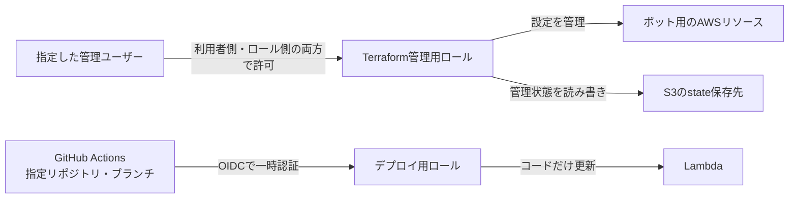
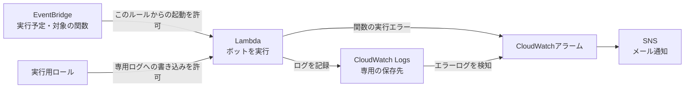

# infra — Terraformによるインフラ管理

MLBボットのAWSリソースをTerraformで管理する。**関数コードのデプロイはGitHub Actionsのまま**で、Terraformはインフラ設定のみを扱う。

## ディレクトリ構成

```
infra/
├── .terraform-version        … tfenv用のバージョン固定（global.jsonと同じ発想）
├── modules/                  … 共通モジュール（リソース定義の本体）
│   ├── scheduled_lambda/     … 定期実行Lambda一式（関数 + 実行ロール + ロググループ + EventBridge）
│   ├── monitoring/           … Lambdaエラーの監視一式（SNSトピック + メール購読 + アラーム + エラーログ監視）
│   ├── github_oidc_role/      … GitHub Actionsの認証とデプロイ用ロール
│   └── assumable_role/        … 指定ユーザーが利用する管理用ロール
└── environments/
    └── prod/                 … 本番環境の実値定義（ここでterraformコマンドを実行する）
        ├── main.tf / monitoring.tf / iam.tf … 各モジュールに実際の値を渡す
        ├── backend.tf                  … state管理の説明（S3バックエンド）
        ├── backend.hcl.example         … S3バックエンド設定の雛形（実物はgitignore）
        ├── terraform.tfvars.example    … 環境固有値の雛形（実物はgitignore）
        └── providers.tf / variables.tf / versions.tf
```

## 管理しているリソース

### 管理・デプロイの権限

IAMロールは、一時的に利用する権限のまとまり。[prod/iam.tf](environments/prod/iam.tf) で「誰に、何の操作を許可するか」を決め、[assumable_role/main.tf](modules/assumable_role/main.tf) で管理用ロールと利用者側の許可を作る。



- **管理用ロール**：利用者側の許可に加え、ロール側でも指定ユーザーの識別子（ARN）を確認する。同じAWSアカウント内の別ユーザー・ロールが、広い権限を持っていても利用できないようにする。
- **デプロイ用ロール**：GitHub Actionsの実行元を確認して一時認証する。認証の仕組みは [github_oidc_role/main.tf](modules/github_oidc_role/main.tf)、許可する操作は `prod/iam.tf` の `deploy_role` で定義する。
- `prod/iam.tf` は、管理ユーザーがIAM設定を管理・修復するための初期設定用権限も管理する。これを失うと、管理者による再付与が必要になる。

### 定期実行・ログ・監視

[scheduled_lambda/main.tf](modules/scheduled_lambda/main.tf) が、関数・実行用ロール・ログ保存先・定期実行をまとめて管理する。監視とメール通知は [monitoring/main.tf](modules/monitoring/main.tf) が担当する。



関数が失敗した場合と、投稿を続行しながらエラーログを残した場合を、それぞれ別のアラームで検知する。
実行時刻・ランタイム・メモリ・制限時間・ログの保存期間は [prod/main.tf](environments/prod/main.tf) を参照。

### 権限と再試行を制限する理由

| 設定 | 適用後の状態 | 理由 |
| --- | --- | --- |
| 管理用ロールの利用者 | 指定したIAMユーザーだけが利用できる | 他のユーザーの権限設定から、意図せず管理用ロールを使われるのを防ぐ |
| Terraformの操作対象 | ボットのログ・通知先・アラームなどに限定する | 名前が似た別のAWSリソースを誤って参照・変更する範囲を減らす |
| Lambdaへの権限の割り当て（PassRole） | Lambdaの実行用ロールだけを、Lambdaサービスへ割り当てられる | 管理用・デプロイ用の強い権限をボットへ渡す事故を防ぐ |
| Lambdaのログ権限 | 専用の保存先への書き込みだけを許可する。保存先の作成・保存期間の設定はTerraformが行う | ボットに不要な管理権限や、別のログ保存先への書き込み権限を持たせない |
| 関数エラー時の再試行 | 自動再試行を行わない | 投稿済みなのに応答だけ失った場合、同じ内容を再投稿するおそれがある |

AWSの仕様上、対象を指定できない一覧取得操作だけは、全体への参照権限を残す。
管理用ロールは自身の権限も編集できるため、引き続き管理者相当の扱いが必要。操作範囲の制限を本人が広げることまで防ぐには、別の管理者が権限の上限を設定する（permissions boundaryやSCP）。

自動再試行を止める分、一時的な障害から自動で投稿し直す機会は減る。また、この設定はAWS側の重複配信すべてを防ぐものではない。再実行に対応する場合は、同じ投稿を二重に送らない仕組みも必要になる（[AWSの再試行仕様](https://docs.aws.amazon.com/lambda/latest/dg/invocation-async-error-handling.html)）。

### 既存環境へ適用するとき

広いログ権限を使い、再試行設定をTerraformで管理していない既存環境では、主に次の変更になる。

| 操作 | 対象 |
| --- | --- |
| 追加 | 専用ログへの書き込み権限、関数エラー時の再試行設定 |
| 更新 | 管理用ロールの利用者を制限する条件、操作できる対象と内容 |
| 紐付け解除 | Lambda実行用ロールに付いているAWS標準の広いログ権限（AWSLambdaBasicExecutionRole） |

この変更でLambda本体やログ保存先を作り直すことは想定していない。実際の追加・更新・削除は現在のAWS側の設定とstateによって変わるため、適用前の `terraform plan` で確認する。

関数コードはGitHub Actions、APIキーなどの環境変数はLambda側で管理する。既存関数では `ignore_changes` により、Terraformがコードや環境変数を上書きしない。コード指定のダミーS3参照は、誤って関数を再作成しようとした際に失敗させるためのものであり、新規作成用のコードではない。

## 初回セットアップ（clone直後）

```bash
cd infra/environments/prod
cp terraform.tfvars.example terraform.tfvars   # 実際の値に書き換える
cp backend.hcl.example backend.hcl             # 実際の値に書き換える
terraform init -backend-config=backend.hcl
terraform plan    # 既存インフラと一致していれば「No changes」になる
```

## 日常の使い方

```bash
cd infra/environments/prod
terraform plan     # 差分確認
terraform apply    # インフラ設定を変更するとき
terraform fmt -recursive && terraform validate   # コミット前
```

各モジュールの `tests/` で、ロールを利用できるユーザー・Lambdaのログ権限・再試行設定を検証できます。
モジュールを `terraform init -backend=false` で準備してから `terraform test` で実行します。
テストはproviderをすべてモック化し、planだけで判定します。AWSの認証情報や本番stateは使いません。

### planでIAMユーザーの情報取得が拒否された場合

`assumable_role` は信頼先ユーザーのARNを取得するため、planの実行者に対象ユーザーへの `iam:GetUser` が必要。
Terraform用ロールにはこの権限があるが、IAMユーザーで直接実行する場合は、そのユーザー側にも許可が必要になる。
`prod/iam.tf` の `ReadTerraformUser` で自身の情報取得だけを許可する。初回は、権限を持つ管理者がこの許可を付与するか、既存のTerraform用ロールで実行する。
plan中に必要な権限なので、定義を追記するだけでは403を解消できない。権限を整えてからplanをやり直し、エラーのない差分を確認して適用する。

### Terraform用ロールでログ保存先の一覧取得が拒否された場合

旧定義では `logs:DescribeLogGroups` の対象も個別のログ保存先に絞っていたため、対象に `*` が必要な一覧取得を許可できていない。
修正後は `prod/iam.tf` の `ResourceDiscovery` で許可するが、適用前のplanにもこの権限が必要になる。
初回はロールの権限を変更できる主体で、`logs:DescribeLogGroups` と `Resource = "*"` だけを一時的な別ポリシーとして付け、planを再実行する。
修正後の定義をapplyし、正式なポリシーで同じ操作を許可できたことを確認してから、一時ポリシーを外してplanを再確認する。

### 権限を追加するapplyで、その権限を使う操作が拒否された場合

Terraform用ロール自身の権限更新と、新しい権限を使う設定変更を同時に行うと、実行順序やIAMの反映待ちによって403になる場合がある。planが成功しても、変更APIの実行権限まで確認できているわけではない。
失敗したapplyでも、成功済みの変更は残る。まず実行ロールの正式なポリシーに必要な操作と対象が反映されたことを確認し、planを取り直して残りの変更を適用する。新しい権限を事前に用意する場合も、対象の操作・リソースだけに限定する。

## state（⚠️ 重要）

- stateは**S3バックエンド**で管理（非公開・暗号化・バージョニング設定済みのバケット）。接続情報は環境固有のためgitignore対象の `backend.hcl` で渡す（雛形: [backend.hcl.example](environments/prod/backend.hcl.example)）
- stateには**Lambda環境変数の値が平文で入る**。バケットやstateの内容を公開・共有しないこと

## 運用メモ

- アラームのメール通知は、SNS購読の確認メールを承認するまで有効にならない（購読を作り直した場合も同様）
- デプロイはOIDC認証（GitHub Secretsの `AWS_DEPLOY_ROLE_ARN` でロール指定）。ロールの信頼はmasterブランチ限定のため、他ブランチからの `workflow_dispatch` は認証段階で拒否される
- Terraform実行用ロールを使う場合は `~/.aws/config` にAssumeRoleプロファイルを追加する（ロールARNは環境固有情報のためここには書かない。AWSコンソールで確認する）

## 次の対応候補

1. **APIキーをSSM Parameter Store（SecureString・無料）へ移行** … アプリが起動時に `ssm:GetParametersByPath` で読む方式にすると、Lambda環境変数とtfstateから機密が消え、キー更新もCLIで完結する（`environment` のignore_changesも不要になる）。実行ロールへの権限付与はTerraform、パラメータ登録はCLI、読み込みはアプリ側の対応
