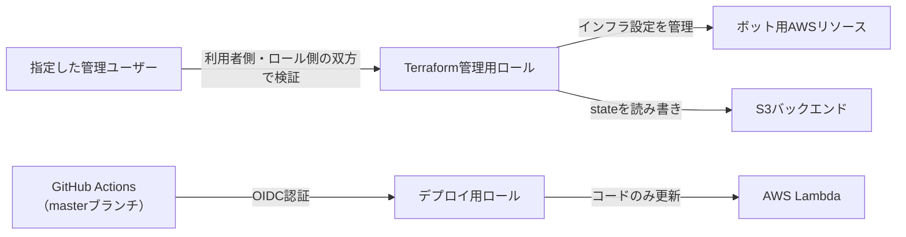
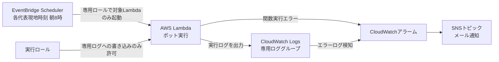

# infra — Terraformによるインフラ管理

MLBボットのAWSインフラをTerraformで管理します。**アプリケーションコードのデプロイはGitHub Actions経由で行い**、Terraformはインフラ設定（Lambda設定、IAM、EventBridge Scheduler、監視など）のみを管理します。

## ディレクトリ構成

```
infra/
├── .terraform-version        … tfenv用のバージョン固定
├── modules/                  … 共通モジュール（リソース定義の本体）
│   ├── scheduled_lambda/     … 定期実行Lambda一式（関数設定 + 実行ロール + ロググループ + Scheduler）
│   ├── monitoring/           … 監視・通知一式（SNSトピック + メール購読 + CloudWatchアラーム + ログ監視）
│   ├── github_oidc_role/     … GitHub ActionsのOIDC認証・デプロイ用ロール
│   └── assumable_role/       … 指定管理者用のAssumeRole
└── environments/
    └── prod/                 … 本番環境設定（Makefileから実行）
        ├── main.tf / monitoring.tf / iam.tf … 各モジュールへのパラメータ渡し
        ├── backend.tf                  … S3バックエンド設定
        ├── backend.hcl.example         … S3バックエンド設定の雛形（実物はGit管理外）
        ├── terraform.tfvars.example    … 環境固有値の雛形（実物はGit管理外）
        └── providers.tf / variables.tf / versions.tf
```

## 管理リソース

### 管理・デプロイの権限（IAM）

[prod/iam.tf](environments/prod/iam.tf) でポリシーを定義し、[assumable_role/main.tf](modules/assumable_role/main.tf) および [github_oidc_role/main.tf](modules/github_oidc_role/main.tf) で各ロールを作成します。



- **Terraform管理用ロール**: 利用者側の許可に加え、ロール側の信頼ポリシーでも指定ユーザーのARNを検証します。同一AWSアカウント内の他ユーザーが広範な権限を持っていても、意図せず本ロールを利用できないよう制限します。また、`prod/iam.tf` には管理ユーザーが自身の設定を修復するための初期設定用権限も含みます。
- **デプロイ用ロール**: GitHub Actionsの実行元（指定リポジトリ・masterブランチ）をOIDCで検証し、一時認証によりLambdaのコード更新のみを許可します（`prod/iam.tf` の `deploy_role` で定義）。

### 定期実行・ログ・監視

[scheduled_lambda/main.tf](modules/scheduled_lambda/main.tf) がLambda関数・実行ロール・CloudWatch Logs・EventBridge Schedulerを一括管理します。監視とメール通知は [monitoring/main.tf](modules/monitoring/main.tf) が担当します。



関数の実行失敗（エラー終了）と、処理継続中に記録されたエラーログの検知を別々のアラームで監視します。実行時刻・ランタイム・メモリ・タイムアウト・ログ保存期間は [prod/main.tf](environments/prod/main.tf) を参照してください。

### 設計方針（権限と再試行の制限理由）

| 設定項目 | 設計内容 | 理由 |
| --- | --- | --- |
| 管理用ロールの信頼先 | 指定したIAMユーザーに限定 | 他のIAMユーザーから管理用ロールへの意図しない昇格・利用を防止するため |
| Terraformの操作範囲 | ボット関連のリソース（ログ・SNS・アラーム等）に限定 | 名称が類似した別システムのリソースを誤って変更する事故を防ぐため |
| Lambdaへの権限割当 (PassRole) | Lambda実行用ロールのみ許可 | 管理用・デプロイ用の強権限ロールが誤ってボットに割り当てられるのを防止するため |
| Lambdaのログ出力権限 | 専用ロググループへの書き込みのみ許可 | 不要な管理権限の排除、および他のロググループへの書き込みを防止するため |
| 関数エラー時の自動再試行 | 自動再試行なし（0回） | 二重投稿を防止するため（詳細は [送信制御仕様](../docs/development.md#送信制御とエラーハンドリング) 参照） |

※ AWSの仕様上、対象リソースを限定できない一覧取得（Describe等）のみ、全体（`Resource = "*"`）への参照を許可しています。  
※ 自動再試行を無効化することで一時障害からの自動復旧は行われません。また、AWS内部の重複配信を完全に防ぐものではないため、再実行基盤を導入する場合はアプリケーション側での重複排除設計が必要となります（[AWSの非同期呼び出し仕様](https://docs.aws.amazon.com/lambda/latest/dg/invocation-async-error-handling.html)）。

### スケジュール設定と運用仕様

- **スケジュールの有効・無効管理**: [prod/main.tf](environments/prod/main.tf) の `schedules_enabled` 変数でコード管理（Git管理）します。環境変数やローカルの `tfvars` では切り替えず、インフラの変更（apply）は人間が手動で実行します。
- **Schedulerのセキュリティ**:
  - 専用のスケジュールグループを使用し、同一アカウントからのみ実行ロールをAssumeRole可能としています。
  - 信頼ポリシーの `SourceArn` には個別スケジュールではなくスケジュールグループのARNを指定しています（[AWS混同代理防止仕様](https://docs.aws.amazon.com/scheduler/latest/UserGuide/cross-service-confused-deputy-prevention.html)）。
  - 実行ロールの権限は対象Lambdaの起動（`lambda:InvokeFunction`）のみに限定しています。
- **再試行設定**: 二重投稿防止のため、SchedulerおよびLambdaの自動再試行回数はともに0回に設定しています。
- **コード・環境変数との分離**: アプリケーションコードはGitHub Actions、APIキー等の環境変数はLambda側で管理します。Terraform側では `ignore_changes` を設定しているため、インフラ更新時にコードや環境変数が上書きされることはありません。また、誤った関数の再作成を検知・失敗させるため、ダミーのS3参照設定を入れています。

## モジュールを別用途で利用する場合

`scheduled_lambda` モジュールは、1つのLambda関数に対して任意の件数のEventBridge Schedulerを紐付ける汎用設計です。`schedules` マップのキーがスケジュール名となり、各要素に `schedule_expression`、`time_zone`（省略時UTC）、`input`（省略可能なJSON文字列）を渡します。MLB固有の地区名や朝8時といった条件は `environments/prod` 側で注入します。

```hcl
schedules = {
  cleanup = {
    schedule_expression = "rate(2 hours)"
    input               = jsonencode({ task = "cleanup", limit = 25 })
  }
  report = {
    schedule_expression = "cron(30 9 ? * MON *)"
    time_zone           = "Asia/Tokyo"
  }
}
```

新規にLambda関数を作成する場合は、`initial_code = { s3_bucket = "…", s3_key = "…" }` に初期デプロイ用コードのS3参照を渡します。省略した場合は既存関数の管理専用となり、誤った再作成を防止します。

## 初回セットアップ（リポジトリclone直後）

事前に `~/.aws/config` にTerraform用のプロファイルを作成してください（[運用メモ](#運用メモ)参照）。

```bash
# リポジトリルートで実行
test -e .env || cp .env.example .env
cp infra/environments/prod/terraform.tfvars.example infra/environments/prod/terraform.tfvars
cp infra/environments/prod/backend.hcl.example infra/environments/prod/backend.hcl

# .env に TF_AWS_PROFILE=<プロファイル名> を設定し、上記2ファイルにも必要な値を設定
make tf-init
make tf-plan    # 既存インフラと一致していれば「No changes」が表示される
```

## 日常の運用コマンド

`.env` に `TF_AWS_PROFILE=プロファイル名` を設定することで、リポジトリルートから以下の `make` コマンドを実行できます（[Makefile](../Makefile) 参照）。

| コマンド | 用途 |
| --- | --- |
| `make` | コマンド一覧を表示 |
| `make tf-plan` | 本番環境との差分確認 |
| `make tf-apply` | 差分確認後、手動承認（`yes`）で本番環境へ適用 |
| `make tf-fmt tf-validate` | インフラコードの書式整形および構文検証 |
| `make tf-test` | モジュール・環境設定のモックテスト実行 |

- `.env` はGit管理外です。プロファイル名のみを読み込み、未設定時は実行前に停止します。
- 一時的にプロファイルを切り替える場合: `make tf-plan TF_AWS_PROFILE=<プロファイル名>`
- ディレクトリを直接移動して実行する場合: `infra/environments/prod` にてプロファイルを指定して実行。
- 単体テスト: `make tf-test` で実行。全プロバイダーをモック化してplanレベルで検証するため、AWS認証情報や本番stateは不要です。

### トラブルシューティング（権限関連）

#### planでIAMユーザー情報の取得が拒否（403）される場合
`assumable_role` が信頼先ユーザーのARNを取得するため、plan実行者に `iam:GetUser` 権限が必要です。IAMユーザーで直接実行する場合、`prod/iam.tf` の `ReadTerraformUser` で自身の情報取得を許可する必要があります。

#### ロググループの一覧取得が拒否（403）される場合
AWSの仕様上、`logs:DescribeLogGroups` はリソース指定による絞り込みができず `Resource = "*"` が必要です。`prod/iam.tf` の `ResourceDiscovery` ポリシーで本操作を許可しています。

#### 権限追加のapplyで、追加した権限を使う操作が拒否される場合
Terraform管理用ロール自身の権限更新と、その新しい権限を必要とする設定変更を同時に行うと、IAMの反映遅延（結果整合性）により一時的に403エラーとなる場合があります。失敗した場合でも適用済みの変更は保持されるため、ロールへの権限反映完了を確認後、再度planを取得して残りの変更を適用してください。

## Terraform State の管理（⚠️ 重要）

- stateは**S3バックエンド**で管理（非公開・暗号化・バージョニング設定済み）。接続先は環境固有値のため、Git管理外の `backend.hcl` で渡します（雛形: [backend.hcl.example](environments/prod/backend.hcl.example)）。
- stateファイルには**Lambda環境変数の値が平文で保存**されます。S3バケットへのアクセス権限は厳重に管理し、外部へ共有しないでください。

## 運用メモ

- **アラーム通知の有効化**: SNSトピック作成後、配信確認メール内の承認リンクをクリックするまでメール通知は有効になりません。
- **Terraformの実行環境**: ローカルからTerraformを実行する場合は、事前に `~/.aws/config` にAssumeRoleプロファイルを構成してください。

## 今後の改善候補

- **SSM Parameter Store への移行**: APIキーをSSM Parameter Store（SecureString）へ移行し、アプリケーション起動時に `ssm:GetParametersByPath` で取得する方式に変更することで、Lambda環境変数およびtfstateから機密情報を排除し、キー更新をAWS CLI経由で完結可能にします。
