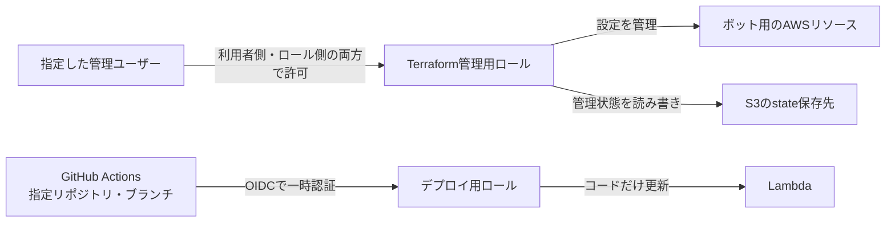

# infra — Terraformによるインフラ管理

MLBボットのAWSリソースをTerraformで管理する。**関数コードのデプロイはGitHub Actionsのまま**で、Terraformはインフラ設定のみを扱う。

## ディレクトリ構成

```
infra/
├── .terraform-version        … tfenv用のバージョン固定（global.jsonと同じ発想）
├── modules/                  … 共通モジュール（リソース定義の本体）
│   ├── scheduled_lambda/     … 定期実行Lambda一式（関数 + 実行ロール + ロググループ + Scheduler）
│   ├── monitoring/           … Lambdaエラーの監視一式（SNSトピック + メール購読 + アラーム + エラーログ監視）
│   ├── github_oidc_role/      … GitHub Actionsの認証とデプロイ用ロール
│   └── assumable_role/        … 指定ユーザーが利用する管理用ロール
└── environments/
    └── prod/                 … 本番環境の実値定義（MakefileがここでTerraformを実行する）
        ├── main.tf / monitoring.tf / iam.tf … 各モジュールに実際の値を渡す
        ├── backend.tf                  … state管理の説明（S3バックエンド）
        ├── backend.hcl.example         … S3バックエンド設定の雛形（実物はgitignore）
        ├── terraform.tfvars.example    … 環境固有値の雛形（実物はgitignore）
        └── providers.tf / variables.tf / versions.tf
```

## 管理しているリソース

### 管理・デプロイの権限

IAMロールは、一時的に利用する権限のまとまり。[prod/iam.tf](environments/prod/iam.tf) で「誰に、何の操作を許可するか」を決め、[assumable_role/main.tf](modules/assumable_role/main.tf) で管理用ロールと利用者側の許可を作る。



- **管理用ロール**：利用者側の許可に加え、ロール側でも指定ユーザーの識別子（ARN）を確認する。同じAWSアカウント内の別ユーザー・ロールが、広い権限を持っていても利用できないようにする。
- **デプロイ用ロール**：GitHub Actionsの実行元を確認して一時認証する。認証の仕組みは [github_oidc_role/main.tf](modules/github_oidc_role/main.tf)、許可する操作は `prod/iam.tf` の `deploy_role` で定義する。
- `prod/iam.tf` は、管理ユーザーがIAM設定を管理・修復するための初期設定用権限も管理する。これを失うと、管理者による再付与が必要になる。

### 定期実行・ログ・監視

[scheduled_lambda/main.tf](modules/scheduled_lambda/main.tf) が、関数・実行用ロール・ログ保存先・定期実行をまとめて管理する。監視とメール通知は [monitoring/main.tf](modules/monitoring/main.tf) が担当する。


関数が失敗した場合と、投稿を続行しながらエラーログを残した場合を、それぞれ別のアラームで検知する。
実行時刻・ランタイム・メモリ・制限時間・ログの保存期間は [prod/main.tf](environments/prod/main.tf) を参照。

### 権限と再試行を制限する理由

| 設定 | 適用後の状態 | 理由 |
| --- | --- | --- |
| 管理用ロールの利用者 | 指定したIAMユーザーだけが利用できる | 他のユーザーの権限設定から、意図せず管理用ロールを使われるのを防ぐ |
| Terraformの操作対象 | ボットのログ・通知先・アラームなどに限定する | 名前が似た別のAWSリソースを誤って参照・変更する範囲を減らす |
| Lambdaへの権限の割り当て（PassRole） | Lambdaの実行用ロールだけを、Lambdaサービスへ割り当てられる | 管理用・デプロイ用の強い権限をボットへ渡す事故を防ぐ |
| Lambdaのログ権限 | 専用の保存先への書き込みだけを許可する。保存先の作成・保存期間の設定はTerraformが行う | ボットに不要な管理権限や、別のログ保存先への書き込み権限を持たせない |
| 関数エラー時の再試行 | 自動再試行を行わない | 投稿済みなのに応答だけ失った場合、同じ内容を再投稿するおそれがある |

AWSの仕様上、対象を指定できない一覧取得操作だけは、全体への参照権限を残す。
管理用ロールは自身の権限も編集できるため、引き続き管理者相当の扱いが必要。操作範囲の制限を本人が広げることまで防ぐには、別の管理者が権限の上限を設定する（permissions boundaryやSCP）。

自動再試行を止める分、一時的な障害から自動で投稿し直す機会は減る。また、この設定はAWS側の重複配信すべてを防ぐものではない。再実行に対応する場合は、同じ投稿を二重に送らない仕組みも必要になる（[AWSの再試行仕様](https://docs.aws.amazon.com/lambda/latest/dg/invocation-async-error-handling.html)）。

### 地区別スケジュールへの切り替え

有効・無効は [prod/main.tf](environments/prod/main.tf) の `schedules_enabled` をGit管理する。環境変数やローカルtfvarsで切り替えない。変更は2 PRに分ける。applyは必ず人間が実行する。

1. **PR①：新コードと無効なスケジュールを準備。** レビュー後、マージ前にPRのブランチで `make tf-plan` を確認して `make tf-apply` を実行する。旧EventBridgeのルール・ターゲット・Lambda起動許可を削除し、専用Schedulerグループ・起動ロール・3件の無効なスケジュールを作成する。Lambda本体・ログ・監視は維持する。
2. **停止を確認してPR①をマージ。** 旧スケジュールが消え、新3件がすべてDISABLEDであること、旧呼び出しが実行中・再配送待ちでないことを確認する。停止は既に受け付けた実行を取り消さない。マージでコードの自動デプロイが始まる。ワークフロー成功だけでなく、Lambdaの `LastUpdateStatus` が `Successful` になり、意図したコードが反映されたことを確認する（現在のデプロイ処理は更新完了を待たない）。確認のためにLambdaを実行しない。
3. **PR②：新スケジュールを有効化。** `schedules_enabled = true` の変更をレビュー・マージし、最新masterで `make tf-plan` と `make tf-apply` を実行する。通常は3件の状態変更だけになる。infraのみの変更ではコードの自動デプロイは走らない。

切り替えは新旧の実行時刻から十分離して行う。新しい表示日と、旧投稿の表示日・対象地区を照合し、最初の3グループが同じ対象日を一通り処理でき、投稿済み分と重複しない開始日を選ぶ。旧投稿がその日分を送信済みなら、その新枠は有効にせず、必要なら翌日の東部枠より前まで停止を維持する。停止中の枠は後からまとめて投稿しない。

移行applyではTerraform管理ロール自身のScheduler権限も追加する。plan成功は変更APIの許可・IAM反映完了の保証ではない。権限不足なら、正式なポリシーへの反映を人間が確認してからplanを取り直す（[権限更新時の注意](#権限を追加するapplyでその権限を使う操作が拒否された場合)）。部分失敗時はPR①をマージせず、旧停止・新無効の状態が揃うまで確認する。

ロールバックもまず新3件を無効化する変更をレビュー・applyし、実行が終了したことを確認する。その後、旧コードと旧スケジュールを無効状態で戻す。旧コード反映と当日の投稿状況を確認してから旧ルールを有効化する。新コードは旧イベントを拒否し、旧コードは新イベントのグループを無視して全地区を投稿するため、コードとイベントの組み合わせを崩さない。

Schedulerは専用グループと同一アカウントからのみ実行ロールを引き受けられ、対象Lambdaの起動だけを許可する。信頼条件のSourceArnは個別スケジュールではなくグループARNを指定する（[AWS仕様](https://docs.aws.amazon.com/scheduler/latest/UserGuide/cross-service-confused-deputy-prevention.html)）。SchedulerとLambdaの関数エラー再試行はともに0回とし、投稿履歴の保存は追加しない。AWS側の重複配送の可能性は残る。

関数コードはGitHub Actions、APIキーなどの環境変数はLambda側で管理する。既存関数では `ignore_changes` により、Terraformがコードや環境変数を上書きしない。この本番設定は初回コードを指定しないため、ダミーS3参照によって誤った関数の再作成を失敗させる。

## モジュールを別用途で使う場合

`scheduled_lambda` は1つのLambdaを任意の件数のSchedulerで起動する。`schedules` のキーがスケジュール名になり、各値に `schedule_expression`、`time_zone`（省略時UTC）、`input`（省略可のJSON文字列）を渡す。MLBの地区名や朝8時という条件はprod側だけに置く。

```hcl
schedules = {
  cleanup = {
    schedule_expression = "rate(2 hours)"
    input               = jsonencode({ task = "cleanup", limit = 25 })
  }
  report = {
    schedule_expression = "cron(30 9 ? * MON *)"
    time_zone           = "Asia/Tokyo"
  }
}
```

新規Lambdaを作る場合は `initial_code = { s3_bucket = "…", s3_key = "…" }` に初回コードのS3参照を渡す。コードの準備と作成権限は呼び出し側で用意する。省略時は従来どおり既存関数の管理専用で、誤再作成を失敗させる。作成後のコード配布・環境変数はTerraform管理外という責務を維持する。

スケジュールは既定で無効、実行時刻の柔軟な遅延は無効、Schedulerの自動再試行は0回とする。任意のAWSサービスを起動する仕組みや、全設定を切り替える汎用基盤には広げない。実行ロールの信頼先と操作対象の制限も共通で維持する。

## 初回セットアップ（clone直後）

先に `~/.aws/config` にTerraform用のプロファイルを作る（[運用メモ](#運用メモ)参照）。

```bash
# リポジトリのルートで実行する
# .envがない場合だけ作成する（既存のAPIキーを上書きしない）
test -e .env || cp .env.example .env
cp infra/environments/prod/terraform.tfvars.example infra/environments/prod/terraform.tfvars
cp infra/environments/prod/backend.hcl.example infra/environments/prod/backend.hcl
# .envにTF_AWS_PROFILE=の行を追加して名前を記入し、残り2ファイルの値も設定する
make tf-init
make tf-plan    # 既存インフラと一致していれば「No changes」になる
```

## 日常の使い方

`.env` に `TF_AWS_PROFILE=プロファイル名` を設定すれば、以下をリポジトリのルートで実行できる（[設定例](../.env.example)・[Makefile](../Makefile)）。毎回のプロファイル指定やディレクトリ移動は不要。

| ルートで実行するコマンド | 用途 |
| --- | --- |
| `make` | コマンド一覧を表示 |
| `make tf-plan` | 本番との差分を確認 |
| `make tf-apply` | 差分を確認し、`yes` で適用（人間が実行） |
| `make tf-fmt tf-validate` | infra全体の書式整形・設定検証 |
| `make tf-test` | テスト対象モジュール・環境設定の準備・モックテスト |

- `.env` はGit管理外。プロファイル名だけを読み、未設定なら接続前に停止する。APIキーやターミナル全体の設定には触れない。
- 一時的な切り替え：`make tf-plan TF_AWS_PROFILE=<プロファイル名>`
- Terraformを直接使う場合：`infra/environments/prod` でプロファイルを指定して実行。
- モジュールのテスト：`make tf-test` で初期化からまとめて実行。
  `modules/*/tests/` でロールの利用者・ログ権限・任意のスケジュール設定を、`environments/prod/tests/` でMLB固有の3グループ・朝8時・無効状態を検証する。
  全providerをモック化し、planだけで判定するため、AWSの認証情報や本番stateは使わない。

### planでIAMユーザーの情報取得が拒否された場合

`assumable_role` は信頼先ユーザーのARNを取得するため、planの実行者に対象ユーザーへの `iam:GetUser` が必要。
Terraform用ロールにはこの権限があるが、IAMユーザーで直接実行する場合は、そのユーザー側にも許可が必要になる。
`prod/iam.tf` の `ReadTerraformUser` で自身の情報取得だけを許可する。初回は、権限を持つ管理者がこの許可を付与するか、既存のTerraform用ロールで実行する。
plan中に必要な権限なので、定義を追記するだけでは403を解消できない。権限を整えてからplanをやり直し、エラーのない差分を確認して適用する。

### Terraform用ロールでログ保存先の一覧取得が拒否された場合

旧定義では `logs:DescribeLogGroups` の対象も個別のログ保存先に絞っていたため、対象に `*` が必要な一覧取得を許可できていない。
修正後は `prod/iam.tf` の `ResourceDiscovery` で許可するが、適用前のplanにもこの権限が必要になる。
初回はロールの権限を変更できる主体で、`logs:DescribeLogGroups` と `Resource = "*"` だけを一時的な別ポリシーとして付け、planを再実行する。
修正後の定義をapplyし、正式なポリシーで同じ操作を許可できたことを確認してから、一時ポリシーを外してplanを再確認する。

### 権限を追加するapplyで、その権限を使う操作が拒否された場合

Terraform用ロール自身の権限更新と、新しい権限を使う設定変更を同時に行うと、実行順序やIAMの反映待ちによって403になる場合がある。planが成功しても、変更APIの実行権限まで確認できているわけではない。
失敗したapplyでも、成功済みの変更は残る。まず実行ロールの正式なポリシーに必要な操作と対象が反映されたことを確認し、planを取り直して残りの変更を適用する。新しい権限を事前に用意する場合も、対象の操作・リソースだけに限定する。

## state（⚠️ 重要）

- stateは**S3バックエンド**で管理（非公開・暗号化・バージョニング設定済みのバケット）。接続情報は環境固有のためgitignore対象の `backend.hcl` で渡す（雛形: [backend.hcl.example](environments/prod/backend.hcl.example)）
- stateには**Lambda環境変数の値が平文で入る**。バケットやstateの内容を公開・共有しないこと

## 運用メモ

- アラームのメール通知は、SNS購読の確認メールを承認するまで有効にならない（購読を作り直した場合も同様）
- デプロイはOIDC認証（GitHub Secretsの `AWS_DEPLOY_ROLE_ARN` でロール指定）。ロールの信頼はmasterブランチ限定のため、他ブランチからの `workflow_dispatch` は認証段階で拒否される
- Terraform実行用ロールを使う場合は `~/.aws/config` にAssumeRoleプロファイルを追加する（ロールARNは環境固有情報のためここには書かない。AWSコンソールで確認する）

## 次の対応候補

1. **APIキーをSSM Parameter Store（SecureString・無料）へ移行** … アプリが起動時に `ssm:GetParametersByPath` で読む方式にすると、Lambda環境変数とtfstateから機密が消え、キー更新もCLIで完結する（`environment` のignore_changesも不要になる）。実行ロールへの権限付与はTerraform、パラメータ登録はCLI、読み込みはアプリ側の対応
